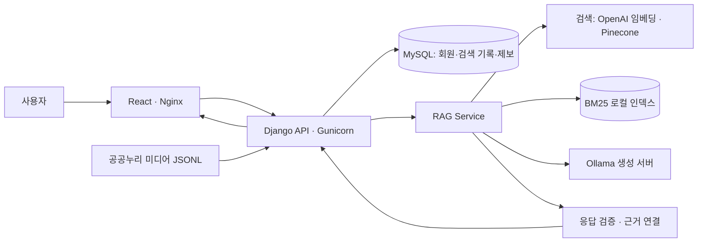

# 개인 맞춤형 AI 문화유산 가이드 — 4차 프로젝트

한국민족문화대백과사전의 자료를 검색하여 사용자가 선택한 설명 수준에 맞는 답변과 출처를 제공하는 웹 서비스입니다. 3차의 검색·생성 기반 위에 회원 기능, 개인 검색 기록, 오류 제보, 사진 자료와 웹 UI를 연결하고 있습니다.

> **현행화 기준: 2026-09-21 · main `06145592de939841f9a5da2d4343138ce2045df6`**
>
> 발표 예정: 2026-09-23(기존 공유 일정). 최종 제출본이 아닌 현재 구현 현황입니다. 병합된 코드와 실제 운영 검증, 검토 중인 시안을 구분합니다. 파일 이동·삭제와 최종 산출물 확정은 후속 진행 상황에 맞춰 별도로 수행합니다.

## 1. 서비스 소개

- 한국의 역사·문화에 관한 질문을 입력하고 설명 수준을 선택합니다.
- 관련 원문을 검색해 답변을 만들고 항목명·원문 링크·근거 내용을 제공합니다.
- 로그인하면 개인 검색 기록에서 저장된 답변을 다시 확인할 수 있습니다.
- 제공되는 사진은 해당 자료의 출처·공공누리 정보를 함께 표시합니다.
- 저장된 답변에 오류가 있으면 본인의 검색 기록과 연결하여 제보할 수 있습니다.

‘개인 맞춤형’의 핵심은 설명 수준 선택입니다. 관심사 분석 기반 추천이 완성됐다는 의미는 아닙니다. 문화유산은 건축·유물뿐 아니라 인물·사건·사상·문학·예술·민속 등 한국 문화 지식을 포함합니다.

## 2. 현재 구현 및 진행 현황

| 구분 | 현재 기준 | 근거 |
|---|---|---|
| React·Django 웹, 회원·검색 기록·기본 오류 제보 | main 반영 | PR #12·#13·#22 |
| 수준별 답변·원문 근거 | 기존 RAG를 웹에 연결 | PR #12 |
| 공공누리 미디어 연결 | main 반영, 미디어 파일과 연결 설정 필요 | PR #16 |
| UI 배치·사진 답변·개인 기록 | main 반영 | PR #22 |
| 완결 문장 중심 핵심 요약 | main 반영, 최종 서비스 회귀 확인 필요 | PR #15 |
| Qwen 27B 비교·전환 권고 | **실험 문서 병합**, 운영 모델 전환 완료 아님 | PR #19 |
| main 테스트 후 EC2 배포 | 자동 배포 구성 반영 | PR #25 |
| 오류 제보 게시판·관리자 처리 | PR 검토 중 | PR #24 |
| 지도 로딩·오류 제보 개선 시안 | Draft, 일부 기능 테스트 전용 | PR #23 |
| 정정·요약·전체 설명 표시 개선 | Draft, 현재 UI와 통합 필요 | PR #18 |
| 문화유산 연관 네트워크 | PR 검토 중, 현재 UI와 통합 필요 | PR #17 |

PR #20·#21은 병합 없이 닫혔습니다. 오류 제보 후속 연결은 #24 기준으로 검토합니다. PR 상태는 바뀔 수 있으므로 [최신 PR 목록](https://github.com/SpicyAutumn/SKN33-4th-1Team/pulls)을 함께 확인합니다.

### 4차 역할·기여 현황

계획상의 단독 담당이 아닌, 2026-09-21까지 확인한 PR 작업을 기준으로 정리했습니다. 공동 작업과 리뷰 기여는 팀 확인 후 보완합니다.

| 팀원 / 계정 | 현재 확인한 주요 기여 | 진행 중·구분할 사항 |
|---|---|---|
| 김문규 / tender0602 | React·Django MVP, 회원·검색 기록·기본 제보·RAG 통합, Docker/AWS 및 자동 배포 (#12·#13·#25) | 전체 실행·배포 통합과 최종 시연 확인 |
| 김유진 / ujinkim2001 | 공공누리 미디어 데이터·출처·이용 조건, 검색 결과 사진 연결 (#3·#16), API·DB 규약 초안 (#14) | #14는 미병합 종료. 미디어 실제 연결 조건 유지 |
| 이준희 / Isnthee | 요약 문장 개선 (#15), 생성 모델 비교·품질 평가 및 신규 기준선 제안 (#19) | 모델 전환 제안과 실제 운영 적용을 구분 |
| 신가을 / SpicyAutumn | Prompt·생성/근거 평가, 정정 후처리, 수준별 비교·LangChain 실험 (#1·#2·#4·#5·#9·#11), UI 통합 (#22), 회의 기록 (#10) | 정정 표시 #18·UI 시안 #23 진행 중, GitHub·발표 문서 정리 |
| 권세진 (팀장) / tangerine0101 | 회원·화면 초기안 (#7·#8), 오류 제보 실험 (#20·#21), 개인 제보·관리자 처리 (#24) | #24 검토 중. 이전 닫힌 PR은 병합 성과와 구분 |
| 채수환 / suhoo898 | 문화유산 연관 네트워크 웹·Docker 연결 (#17) | 미병합. 후속 데이터/API 유지 담당 지정 필요 |

**참여 변경:** 채수환님은 9월 17일 이번 4차 프로젝트 참여가 어렵다는 의사를 전달했습니다(사용자 공유 기준). 이전 기여를 지우거나 다른 사람에게 일괄 귀속하지 않고, 이후 수행 내역을 구분합니다. 권세진님은 팀장으로서 참여하며, 오류 제보 게시판·관리자 기능 관련 기여는 위 PR 기준으로 기록합니다. 계정과 실명 연결은 사용자 확인을 반영했습니다.

채수환님이 3차에서 수행했던 RAG 관련 영역은 4차 PR상 **김문규님의 웹·실행 통합, 이준희님의 요약·모델 평가, 신가을님의 생성 평가·정정·답변 UI, 김유진님의 미디어 연결**로 나누어 후속 작업이 확인됩니다. 이는 공식 인계 완료나 단독 책임을 뜻하지 않습니다. 일정·최종 범위 확정과 네트워크 유지 담당은 팀 협의가 필요합니다.

상세 근거와 인계 확인 항목: [4차 역할·기여 현행화 근거](docs/FOURTH_TEAM_CONTRIBUTIONS.md).

## 3. 동작 구조



BM25 인덱스 유무에 따라 Hybrid 또는 Dense 검색을 사용합니다. MySQL은 별도 제공 서버를 사용하며 Compose에 MySQL 서비스는 없습니다. 생성 모델은 `OLLAMA_MODEL`과 실제 Ollama 서버 설정으로 결정합니다. README의 실험 모델명이 운영 모델을 뜻하지 않습니다.

## 4. 실행 방법 — 4차 웹 서비스

### 준비

Git, Docker Desktop과 팀에서 제공하는 DB·검색·모델 연결 설정이 필요합니다. 실제 답변 생성에는 Ollama 서버가 실행 중이어야 합니다.

```powershell
git clone https://github.com/SpicyAutumn/SKN33-4th-1Team.git
cd SKN33-4th-1Team
```

루트에 비공개 `.env`를 준비합니다. 새로 복제한 폴더에서만 `.env.example`을 복사하며, 기존 `.env`를 덮어쓰지 않습니다. 다음은 확인할 **변수 이름**입니다. 실제 값은 문서·저장소·공유 캡처에 넣지 않습니다.

| 용도 | 확인할 변수 |
|---|---|
| DB | `MYSQL_HOST`, `MYSQL_PORT`, `MYSQL_USER`, `MYSQL_PASSWORD`, `MYSQL_DATABASE` |
| Django | `DJANGO_SECRET_KEY`, `DJANGO_DEBUG`, `DJANGO_ALLOWED_HOSTS`, `DJANGO_COOKIE_SECURE` |
| 검색 | `OPENAI_API_KEY`, `OPENAI_EMBEDDING_MODEL`, `PINECONE_API_KEY`, `PINECONE_INDEX_NAME`, `PINECONE_NAMESPACE` |
| 생성 | `OLLAMA_BASE_URL`, `OLLAMA_MODEL` |

Docker 컨테이너에서 `127.0.0.1`은 해당 컨테이너 자신입니다. Windows 호스트의 SSH 터널에 연결한다면 컨테이너에서 접근할 수 있는 주소·포트를 별도로 확인해야 합니다. PyCharm의 DB 연결 성공만으로 웹 서버 설정까지 완료된 것은 아닙니다.

팀 공유 데이터는 아래 위치에 준비합니다. 대용량 원본은 Git에 추가하지 않습니다.

```text
data/processed/aks_bm25_v1.sqlite3
data/processed/aks_article_medias.jsonl
```

현재 Compose는 두 경로를 읽기 전용으로 연결합니다. 실행 전에 파일인지 확인하세요. 없는 경로가 폴더로 생성되면 정상 파일로 연결되지 않습니다. 인덱스 미사용 시 Dense 검색, 미디어 미사용 시 텍스트 응답을 사용할 수 있지만 Compose 연결 경로도 해당 실행 방식에 맞게 준비해야 합니다.

### 시작·설정 재적용

`docker-compose.yml`이 있는 저장소 루트에서 실행합니다.

```powershell
docker compose up --build -d
docker compose ps
```

- 웹: http://localhost:8081/
- 상태 확인: http://localhost:8081/api/health

환경 변수를 변경한 뒤 컨테이너를 재생성합니다.

```powershell
docker compose up --build -d --force-recreate
```

상태 확인 성공은 실제 검색·회원·전체 DB 테이블의 정상 동작을 보장하지 않습니다. DB 스키마 준비는 담당자와 확인하며 공유 DB에 임의 마이그레이션을 실행하지 않습니다.

```powershell
# 로그는 키·개인정보를 제외하고 필요한 오류만 공유합니다.
docker compose logs --tail 100 backend
# 서비스 종료: 외부 MySQL 데이터는 삭제하지 않습니다.
docker compose down
```

상세 절차: [Docker 실행 안내](docs/DOCKER_RUNBOOK.md). 3차의 `python run.py`는 Streamlit 경로이며 위 React 웹 실행과 구분합니다.

## 5. 평가 결과를 읽는 기준

- 3차 데이터 규모·검색 성능·LangGraph 수치는 **3차 저장소의 기록**에서 확인합니다. 4차 개선 성과로 다시 합산하지 않습니다.
- #19는 EXAONE과 Qwen 비교 및 LangChain·LangGraph 실험 결과를 정리한 문서입니다. 응답 유형 일치율은 전체 사실 정확도가 아닙니다.
- Qwen 전환 권고와 실제 운영 적용은 별개입니다. 최신 API·실시간 검색·Docker·사용자 화면까지 연결한 검증이 추가로 필요합니다.
- LangChain·LangGraph 실험을 했다는 사실과 운영 경로에 채택했다는 주장을 구분합니다.
- 발표 수치에는 질문 수, 데이터 구분, 모델·프롬프트, 평가 방법과 한계를 함께 표시합니다.

평가 근거: [PR #19](https://github.com/SpicyAutumn/SKN33-4th-1Team/pull/19), [3차 출발 기준](docs/FOURTH_PROJECT_BASELINE.md).

## 6. 발표·최종 제출 전 확인

| 확인할 항목 | 완료 기준 |
|---|---|
| 기능 범위 | 미병합 PR·테스트 전용 시안을 완료 기능과 구분 |
| 실제 시연 | 로그인 → 질문 → 답변·사진·근거 → 저장 기록 재조회 확인 |
| 오류 제보 | 현재 입력 규칙으로 등록 확인, #24 병합 시 본인 내역·관리자 처리까지 확인 |
| 모델·품질 | 실제 운영 모델과 평가 조건 확정, 대표 질문과 실패 사례 확인 |
| UI | 모바일·태블릿, 긴 제목·출처, 사진 없음, 검색 실패 상태 확인 |
| 제출 문서 | README·아키텍처·발표 자료·테스트 보고서의 기준 커밋 통일 |
| 파일·산출물 | 최종 단계에서만 불필요 파일 분류, ZIP·체크섬·제출 목록 확정 |

위 4차 역할표의 계정·실명 연결은 확인되었습니다. 최종 공동 기여와 후속 인계 담당은 팀 확인 후 확정합니다. 현재 문서 현행화 과정에서는 서비스 실행이나 외부 API 평가를 재수행하지 않았습니다.

## 7. 문서와 자료 이용

- [Docker 실행 안내](docs/DOCKER_RUNBOOK.md)
- [4차 출발 기준과 재사용 범위](docs/FOURTH_PROJECT_BASELINE.md)
- [자동 배포 안내 — 확인 기준 커밋](https://github.com/SpicyAutumn/SKN33-4th-1Team/blob/06145592de939841f9a5da2d4343138ce2045df6/docs/MAIN_AUTO_DEPLOY.md)
- [UI 시안과 캡처 — PR #23](https://github.com/SpicyAutumn/SKN33-4th-1Team/pull/23)
- [협업 규칙](CONTRIBUTING.md)

텍스트 원문 출처와 사진의 개별 이용 조건을 구분합니다. `.env`, 인증 정보, 개인정보와 대용량 원본은 제출·공유 대상에서 제외합니다. main에는 자동 배포가 연결되어 있으므로 병합 전 검토를 마칩니다.

---

## 8. 3차 프로젝트 참고

4차는 3차의 데이터·검색·생성 기반을 이어서 개발했습니다. 당시 역할, 실험 결과, Streamlit 실행 방법과 제출 이력은 원본 저장소에서 확인할 수 있습니다.

- [3차 프로젝트 저장소](https://github.com/SpicyAutumn/SKN33-3rd-1Team)
- [4차 출발 시점의 3차 README](https://github.com/SpicyAutumn/SKN33-3rd-1Team/blob/18b88da95d77eb07c5055dd2769f215df7024bb0/README.md)
- [4차 재사용 범위와 출발 기준](docs/FOURTH_PROJECT_BASELINE.md)
