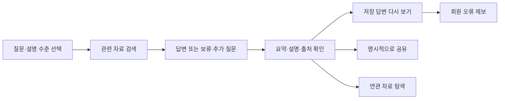
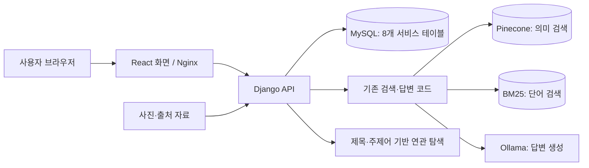

# 개인 맞춤형 AI 문화유산 가이드

> 한국의 역사·문화를 질문하고, 설명 수준에 맞는 답변과 근거 자료를 확인하는 AI 웹 서비스

**SKN AI 캠프 4차 프로젝트**

**서비스 바로가기: [문화유산 AI 가이드](https://skn33heritage.site/)**

## 1. 프로젝트 소개

한국민족문화대백과사전 자료에서 질문과 관련된 내용을 검색하고, 이를 바탕으로 설명 수준에 맞는 답변을 제공한다.

문화유산 현장에 방문하지 않아도 이용할 수 있으며, 유물·건축물 외에 인물·사건 등 한국의 역사·문화 지식을 다룬다.

RAG는 **관련 자료를 먼저 찾고 그 자료를 참고해 답변을 만드는 방식**이다. 모든 질문에 답하는 것이 목표는 아니다. 근거가 부족하거나 질문의 의미가 불분명할 때는 답변 보류·추가 질문 등으로 구분한다.

## 2. 주요 이용 기능

| 하고 싶은 일 | 제공 기능 | 알아둘 점 |
|---|---|---|
| 이해하기 쉬운 설명 받기 | 초등학생·중고등학생·성인 일반 수준 선택 | 실제 나이를 인증하거나 자동 추정하지 않는다 |
| 설명의 근거 확인 | 원문 링크·근거 내용·연결 가능한 사진 표시 | 텍스트 출처와 사진 이용 조건은 별도로 확인한다 |
| 답변 다시 열기 | 검색 결과별 개인 주소, 회원 검색 기록 | 비회원은 검색한 브라우저의 쿠키가 필요하다 |
| 다른 사람에게 전달 | 사용자가 선택한 답변의 공개 공유 링크 | 링크를 가진 사람은 로그인 없이 볼 수 있다 |
| 관련 내용 이어 보기 | 제목·주제어에 근거한 연관 자료 추천 | 역사적 관계를 본문으로 검증한 결과는 아니다 |
| 잘못된 답변 알리기 | 회원의 저장 답변에 연결된 오류 제보 | 기본 화면에서는 오류 유형 한 가지와 설명을 입력한다. 관리자는 제보를 확인하고 처리한다 |
| 계정 관리 | 내 정보·비밀번호 변경, 탈퇴 | 중요 정보 변경·탈퇴 시 현재 비밀번호를 확인한다 |

`개인 맞춤형`은 우선 **사용자가 선택한 설명 수준을 반영한다**는 의미이다. 성향을 자동 분석하는 기능과 구분한다.

### 사용 흐름



## 3. 3차와 4차의 관계

| 구분 | 3차 기반 | 4차 확장 |
|---|---|---|
| 이용 화면 | Streamlit 기반 LLM 앱 | React 웹 화면 |
| 검색·답변 | 자료 검색, 수준별 생성, 근거 연결 | Django API를 통해 웹과 기존 RAG 연결 |
| 이용 기록 | 당시 앱 범위 | 회원 기록·개인 결과 주소·공유 |
| 피드백 | 당시 구현·평가 기록 보존 | 오류 제보·관리자 처리 화면 |
| 실행 환경 | 기존 실행 방법 보존 | Docker, 웹 배포, 분리된 테스트 환경 |
| 평가 | 기존 실험 결과 | 모델·표현·웹 기능 비교와 통합 시험 |

4차는 3차의 검색·생성 기반을 재사용하고, 웹 화면·회원 기록·공유·오류 제보 기능으로 확장했다.

모델 비교 결과는 평가 자료에 정리하며, 실제 서비스에 사용하는 모델은 운영 설정으로 관리한다.

## 4. 시스템 구성



MySQL은 서비스 이용 기록을, 검색 인덱스는 답변 근거를 찾는 자료를 관리한다. 두 저장소의 역할은 다르다.

[서비스 데이터베이스 관계도](docs/deliverables/04_erd.md)에는 회원·로그인, 검색·근거·공유, 오류 제보·유형·선택 문구의 연결을 표시했다.

실제 생성 모델은 실행 환경의 설정으로 결정되므로 실험 보고서의 모델 이름만으로 운영 모델을 단정하지 않는다.

## 5. 문서 안내

| 알고 싶은 내용 | 문서 |
|---|---|
| 제출 자료 전체 | [산출물 목차](docs/deliverables/README.md) |
| 목표·사용자 요구 | [요구 사항 정의서](docs/deliverables/01_requirements.md) |
| 화면과 이동 흐름 | [화면 설계서](docs/deliverables/02_screens.md) |
| 구성요소와 연결 | [시스템 구성도](docs/deliverables/03_architecture.md) |
| 데이터 관계 | [그림과 설명을 포함한 ERD](docs/deliverables/04_erd.md) |
| 화면·서버 통신 규칙 | [API 명세서](docs/deliverables/05_api.md) |
| 검사 방법과 확인 결과 | [테스트 계획·통합 결과](docs/deliverables/06_tests.md) |
| 3차·4차 앱 실행 및 제출 | [실행·제출 안내](docs/deliverables/07_release.md) |

## 6. 실행 안내

저장소를 내려받은 뒤 Docker와 팀에서 안내하는 비공개 설정을 준비한다. 검색 인덱스·사진 자료와 외부 DB·검색·생성 서버 연결이 필요하다.

코드만 내려받는 것으로 실제 AI 응답 준비가 완료되지는 않는다.

```powershell
git clone https://github.com/SpicyAutumn/SKN33-4th-1Team.git
cd SKN33-4th-1Team
# 비공개 설정과 데이터 준비를 마친 뒤 실행
docker compose up --build -d
docker compose ps
```

로컬 실행 주소는 `http://localhost:8081/`이다. 상태 확인 주소 `/api/health`가 응답하더라도 로그인·실제 검색·DB 저장까지 정상이라는 뜻은 아니다.

외부 DB에 대한 구조 변경은 담당자 확인 없이 실행하지 않는다.

자세한 준비물과 3차 실행 경로는 [실행·제출 안내](docs/deliverables/07_release.md)를 따른다.

## 7. 개발·운영·테스트 구분

| 구분 | 목적 | 기준 |
|---|---|---|
| 개인 로컬 | 개발자가 기능 확인 | 해당 PC의 코드·설정 |
| 운영 환경 | 사용자에게 서비스 제공 | [skn33heritage.site](https://skn33heritage.site/) |
| 공용 테스트 | 여러 변경을 합쳐 사전 확인 | main과 preview 대상 PR의 조합 |

공용 테스트 환경은 구성 변경 시 DB를 유지한다. DB 구조 변경 전에 백업하고, 마이그레이션 이후 검증에 실패하면 추가 배포를 차단한다.

자동 검사 결과와 서비스 통합 검증 결과는 [테스트 보고서](docs/deliverables/06_tests.md)에서 각각 확인할 수 있다.

## 8. 팀과 협업

| 팀원 | 확인된 주요 기여 |
|---|---|
| 권세진 · 팀장 | 회원·화면 초기안, 제보 게시판·관리자 처리 |
| 김문규 | 웹·RAG·DB 통합, Docker·AWS 실행, 배포·테스트 환경 |
| 김유진 | 미디어 데이터·출처·이용 조건, 사진 연결, API·DB 규약 초안 |
| 이준희 | 요약 개선, 생성 모델 비교·품질 평가 |
| 신가을 | Prompt·생성/근거 평가, 수준별 비교, 화면 통합·문서 정리 |
| 채수환 | 문화유산 연관 네트워크의 웹·Docker 연결 제안과 실험 |

위 표는 프로젝트 수행 중의 기여를 정리한 것이며, 현재 유지·보수 담당 배정과는 구분한다.

기능 변경은 브랜치에서 작업하고 리뷰 후 반영한다. 파일 삭제·이동은 실행 코드·자동 검사·문서 링크 영향을 함께 확인한다.

## 9. 품질과 한계

- 답변 출처를 제공하더라도 사실 오류가 완전히 없어지는 것은 아니다.
- 추천은 목록의 제목·주제어 기반이며, 동명이인이나 별칭은 잘못 연결되거나 누락될 수 있다.
- 공개 공유 링크는 재공유를 막지 못하며, 현재 공유 취소·만료 기능은 포함하지 않는다.
- 기존 실험 결과는 표본·모델·검색 조건을 함께 제시한다. 자동 점수를 서비스 전체 정확도로 표현하지 않는다.
- 기본 제보 화면은 오류 유형 한 가지를 전송한다. 서버가 지원하는 복수 유형·선택 문구 저장 기능과 현재 화면의 입력 방식은 [API 명세](docs/deliverables/05_api.md)에서 구분한다.

[3차 프로젝트 저장소](https://github.com/SpicyAutumn/SKN33-3rd-1Team) · [4차 프로젝트 저장소](https://github.com/SpicyAutumn/SKN33-4th-1Team)
