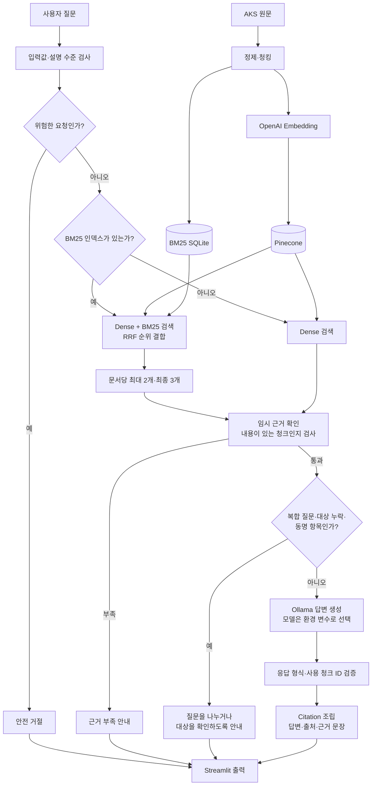

# 개인 맞춤형 AI 문화유산 가이드 — 4차 프로젝트

> **4차 착수 저장소**: 3차 제출 코드에서 출발합니다. 현재 아래 구현·평가 결과는 **3차 기준선**이며 4차 개선 성과가 아닙니다.
>
> 출발 저장소: https://github.com/SpicyAutumn/SKN33-3rd-1Team
>
> 출발 커밋: `18b88da95d77eb07c5055dd2769f215df7024bb0`
>
> 발표 예정일: 2026-09-23 (사용자 전달 일정 기준)
>
> 4차 목표: 같은 조건에서 수준별 Prompt·답변 품질을 비교하고, 결과에 따라 검색·근거 판단과 생성 품질을 개선합니다. 세부 범위·역할·모델·비용은 팀 협의 후 확정합니다.
>
> 재사용 범위·기여와 이후 절차: [4차 출발 기준](docs/FOURTH_PROJECT_BASELINE.md)

## 3차 기준선 설명 및 실행 방법

> SKN AI 캠프 3차 단위 프로젝트 — LLM/RAG 1팀
>
> 한국민족문화대백과사전의 문화유산·인물·사건·사상·문학·예술 정보를 찾아, 사용자의 이해 수준에 맞는 설명과 확인 가능한 출처를 제공하는 RAG 기반 지식 안내 서비스
>
> 문서 기준일: 2026-09-03
>
> 기준 코드: PR #29와 PR #31까지 반영된 `main` (`f38ac05`)

한국민족문화대백과사전의 공식 자료에서 질문과 관련된 내용을 찾아, 사용자가 선택한 이해 수준에 맞는 답변과 원문 출처를 제공하는 서비스입니다.

질문과 글의 뜻을 비교하는 **의미 검색**과 제목·별칭의 정확한 낱말을 찾는 **BM25 검색**을 함께 사용합니다. 답변은 검색된 근거 안에서만 만들고, 실제로 사용한 원문 조각을 검사해 출처와 연결합니다.

이 프로젝트에서 **문화유산**은 지정 문화재만을 뜻하지 않습니다. 장소·건축·유물뿐 아니라 인물·사건·제도·사상·문학·예술·민속 등 한국의 역사와 문화를 이루는 다양한 지식을 함께 다룹니다.

현재의 **개인 맞춤형**은 사용자가 `easy`, `general`, `advanced` 중 설명 수준을 직접 선택하는 방식입니다. 개인별 이용 기록이나 관심사를 분석한 자동 추천 기능은 이번 범위에 포함하지 않으며, 후속 확장 대상으로 구분합니다.

## 1. 프로젝트 목표

한국의 문화유산뿐 아니라 인물·사건·사상·문학·예술·민속 등에 관한 질문을 다음 원칙으로 처리합니다.

> 사용자가 한국의 역사와 문화에 관해 질문하면, 관련 백과사전 원문을 찾아 이해 수준에 맞게 설명하고 출처와 근거 문장을 함께 제공합니다.

- 공식 자료에서 확인되는 내용만 설명합니다.
- 사용자가 `쉽게`, `일반`, `깊이 있게` 중 설명 수준을 고를 수 있습니다.
- 답변에 사용한 원문 제목, URL과 근거 문장을 함께 보여 줍니다.
- 근거가 부족하거나 대상이 모호하면 추측하지 않고 그 이유를 안내합니다.
- 검색과 답변이 만들어지는 과정을 화면에서 확인할 수 있게 합니다.

## 2. 팀 소개

| 이름 | 주요 담당·기여 영역 |
| :--- | :--- |
| 채수환 | 프로젝트 목표·범위, 일정, 작업 조정과 결과물 통합 |
| 김유진 | API 수집, 원본 저장, 출처·라이선스와 manifest 관리 |
| 권세진 (팀장) | 정제·청킹·임베딩·Vector DB·Retriever와 검색 평가 |
| 신가을 | Prompt Baseline, 생성 평가, Fine-tuning 데이터·학습·비교 설계 |
| 이준희 | RAG Chain·응답 계약·근거 판정·통합 평가 설계와 검토 |
| 김문규 | Streamlit·UX, 실제 RAG·Ollama 연결, 시연·배포·발표 |

담당 영역은 혼자 모든 작업을 수행한다는 뜻이 아닙니다. 서로 연결되는 데이터 형식과 최종 동작은 관련 담당자가 함께 검토했습니다.

## 3. 현재 구현 상태

### `main`에 반영된 기능

| 영역 | 상태 | 현재 구현 |
| :--- | :---: | :--- |
| 원본 수집·검증 | 완료 | AKS OpenAPI 원본 75,835건 수집 및 무결성 확인 |
| 정제·청킹 | 완료 | 본문 없는 15건을 제외한 75,820개 문서를 179,028개 청크로 구성 |
| Dense 검색 | 완료 | OpenAI 임베딩과 Pinecone을 이용한 의미 검색 |
| BM25·Hybrid 검색 | 완료 | 정확한 낱말 검색과 의미 검색의 순위를 RRF로 결합 |
| 검색 결과 다양화 | 완료 | 같은 문서의 청크는 최대 2개까지 선택하면서 최종 3개를 구성 |
| RAG Service | 완료 | 검색, 근거 확인, 생성, 응답 검증과 Citation 조립 연결 |
| 실제 답변 생성 | 완료 | RunPod의 Ollama HTTP 모델을 Streamlit과 연결하고 시연 기준 모델을 EXAONE으로 설정 |
| 요청 범위 확인 | 완료 | 한국 역사·문화 범위를 벗어난 질문은 검색 전에 안내하고 종료 |
| 화면 | 기본 통합 완료 | 질문하기, 답변 과정, 파이프라인, 평가 결과와 문화유산 네트워크 제공 |
| Prompt·생성 평가 기준 | 문서화 완료 | 설명 수준, 응답 형식, Baseline 비교 원칙 정리 |
| RAGAS 답변 평가 | 기능 반영 | `Faithfulness`와 `Answer Relevancy`를 검색 평가와 분리해 계산 |
| Fine-tuning | 3차 미적용 | Baseline 결과와 필요성을 확인한 뒤 후속 프로젝트에서 검토 |

### 3차 프로젝트 반영 범위에서 제외한 작업

| 작업 | 3차 결정 | 이유와 후속 방향 |
| :--- | :---: | :--- |
| PR #21 모델 독립형 생성 컴포넌트 | 미반영 | 현재 Ollama 생성 경로와 기능이 겹쳐, 여러 모델을 같은 방식으로 비교할 필요가 생길 때 다시 검토 |
| PR #27 설명 수준별 Prompt 개선 | 미반영 | 최종 완성과 회귀 검증이 끝나지 않아 안정된 기존 Prompt를 유지하고 후속 과제로 분리 |
| LangGraph 실행 경로 | 미반영 | 개선안의 정확도 향상은 확인했지만 응답 지연과 발표 전 통합·회귀 검증 시간을 함께 고려 |
| Fine-tuning | 미반영 | 먼저 검색과 Prompt Baseline에서 부족한 행동을 확인한 뒤 동일 조건으로 전후 비교할 필요가 있음 |

시연 모델은 `exaone3.5:7.8b-instruct-q8_0`으로 설정했습니다. Qwen과의 소규모 비교에서는 EXAONE이 어려운 한자 표현을 덜 사용하고, 설명을 문장으로 풀어 변화 흐름을 따라가기 쉬운 사례가 관찰되었습니다. 이는 제한된 질문에서 확인한 정성 결과이므로 모든 질문에서 더 우수하다는 뜻은 아닙니다.

### LangGraph 적용 검토 결과

초기 LangGraph 안은 기존 방식보다 유의미한 향상을 보이지 않았습니다. 이후 분기 이유를 더 구체적으로 나누는 개선안에서는 정확도가 높아졌지만, 평균 응답시간도 늘었습니다.

| 지표 | 기존 방식 | 초기 LangGraph | 이유 기반 LangGraph |
| :--- | ---: | ---: | ---: |
| 응답 유형 정확도 | 72.7% | 69.7% | **78.8%** |
| 보류 판단 정확도 | 72.7% | 69.7% | **84.8%** |
| Citation recall | 64.0% | 60.0% | **76.0%** |
| 평균 응답시간 | **7,628ms** | 7,936ms | 9,725ms |

이유 기반 개선안은 기존 방식보다 응답 유형 정확도 `6.1%p`, 보류 판단 정확도 `12.1%p`, Citation recall `12.0%p`가 높았습니다. 반면 평균 응답시간은 `2,097ms`, 약 27.5% 증가했습니다. 전체 결과에서는 Citation precision이 100%에서 95%로 낮아졌고, 세 방식 모두 실행 오류는 없었습니다.

따라서 개선 효과 자체는 확인했지만, 발표 일정 안에 실제 서비스 경로와 합치고 전체 회귀 테스트까지 마치기에는 위험이 있다고 판단했습니다. 3차 프로젝트는 현재 `RagService`의 조건 분기 방식을 유지하고, 이유 기반 LangGraph는 **성능과 안정성을 더 검증할 후속 과제**로 남깁니다.

## 4. 전체 동작 흐름

### 현재 `main`에서 실제로 동작하는 흐름



쉽게 말하면 다음 순서입니다.

1. 질문 형식과 위험한 요청 여부를 먼저 확인합니다.
2. 로컬 BM25 인덱스가 있으면 Dense와 BM25를 함께 사용하고, 없으면 Pinecone Dense 검색만 사용합니다.
3. Hybrid 검색에서는 같은 문서의 청크를 최대 2개로 제한하면서 최종 3개를 고릅니다.
4. 현재 임시 근거 판정기는 검색 본문이 비어 있지 않은지 확인합니다. 질문에 실제로 답하는 근거인지 의미를 읽고 판정하는 기능은 아직 교체 대상입니다.
5. 복합 질문, `그 궁궐`처럼 대상이 빠진 질문, 검색 결과에 같은 제목의 다른 문서가 있는 질문은 답변 대상을 다시 확인합니다. 그 밖의 질문은 Ollama 모델이 답변을 만듭니다.
6. 모델에는 긴 청크 ID 대신 `CTX-1` 같은 짧은 참조를 전달합니다. 반환된 참조를 실제 청크 ID로 되돌리고 검색 결과와 대조한 뒤, 검증된 제목·URL·본문만 출처와 근거 문장으로 표시합니다.

### 최초 README 계획과 현재 구현 비교

최초 README는 구현 전 계획이므로 `질문 전처리 → 검색 → 근거 충분성 판단 → LLM → 답변과 출처`라는 큰 방향만 제시했습니다. 실제 구현에서는 다음과 같이 구체화되었습니다.

| 구분 | 최초 README의 계획 | 현재 `main` 구현 | 아직 적용 전이거나 보완할 부분 |
| :--- | :--- | :--- | :--- |
| 질문 사전 확인 | 질문 전처리 | 빈 질문·설명 수준·위험 요청 검사 | 모든 자유로운 표현을 이해하는 범용 판정은 아님 |
| 서비스 범위 | 답변 불가 질문 처리 | `TopicScopeChecker`가 범위 밖 질문을 검색 전에 차단 | 범위가 애매한 표현과 복합 질문 정교화 |
| 검색 | Vector DB `top_k` 검색 | BM25 파일이 있으면 Hybrid, 없으면 Dense | 검색어 재작성과 자동 재검색은 없음 |
| 근거 판정 | 근거가 충분한지 판단 | 본문이 있는지 확인하는 임시 판정기 | 질문과 근거의 의미 관계를 판정하는 실제 EvidenceChecker 필요 |
| 모호·복합 질문 | 모호한 질문 평가 | 복합 질문, 대상이 빠진 일부 표현, 검색 결과의 동명 항목을 확인해 `needs_clarification`으로 안내 | 규칙 밖 표현과 오타·줄임말 후보 확인은 제한적 |
| 답변 생성 | 근거 제한 Prompt와 LLM | EXAONE 기반 Ollama가 수준별 답변과 사용 청크 ID를 구조화된 형식으로 생성 | PR #27의 가독성 개선안은 후속 검증 대상 |
| 검증·출처 | 답변과 출처 표시 | 짧은 근거 참조를 실제 ID로 복원하고 응답 형식·ID를 검사한 뒤 검색 원문에서 Citation 조립 | 복원할 수 없는 형식 오류에 대한 일반 재생성 경로는 제한적 |
| LangGraph | 분기·반복이 필요할 때 선택 적용 | 사용하지 않고 `RagService`의 Python 조건문으로 순서 제어 | 이유 기반 개선안의 지연·통합 안정성을 후속 검증 |

첨부된 기존 흐름 그림의 `요청 사전 검사 → 검색 → 근거 판단 → 답변 생성 → Streamlit`은 현재 구조를 요약하는 기준선으로 사용할 수 있습니다. 다만 정확하게 표현하려면 다음 세 가지 주석이 필요합니다.

- `needs_clarification`: 복합 질문, `그 궁궐` 같은 대상 누락 표현과 검색 결과의 동명 항목은 규칙으로 먼저 확인합니다. 그 밖의 모호한 표현은 생성 응답 형식에서 처리할 수 있지만 모든 표현을 보장하지는 않습니다.
- `scope_checker`: `TopicScopeChecker`가 현재 서비스에 연결되어 한국 역사·문화 범위를 벗어난 질문은 검색 전에 안내합니다.
- `correctable_premise`: 현재 근거 판정기가 이 이유를 생성기에 전달하지는 않습니다. 생성 모델이 검색 문맥을 보고 `corrected_premise`를 선택하며, 답변 내용은 전제를 고쳤지만 유형만 다르게 반환한 일부 경우에는 실행 코드가 유형을 맞춘 뒤 근거 ID를 검사합니다.

## 5. 데이터와 품질 관리

### 데이터 출처

- 기관: 한국학중앙연구원(AKS, Academy of Korean Studies)
- 서비스: [한국민족문화대백과사전](https://encykorea.aks.ac.kr/)
- 수집 방식: 공식 OpenAPI 목록·상세 API
- 이번 RAG 범위: 텍스트 본문과 분류·별칭 등 검색용 메타데이터
- 제외 범위: 이미지·영상·음성 등 권리 조건을 별도로 확인해야 하는 미디어

### 검증 결과

| 확인 항목 | 결과 |
| :--- | ---: |
| 수집한 원본 | 75,835건 |
| 최종 포함 문서 | 75,820건 |
| 본문이 없어 제외한 문서 | 15건 |
| 최종 청크 | 179,028건 |
| JSON·청크 필드 오류 | 0건 |
| 중복 청크 ID | 0건 |
| 대상 문서 누락 | 0건 |
| 제외 대상의 잘못된 포함 | 0건 |

원본 JSON·JSONL과 생성된 BM25 DB는 용량과 이용 조건 때문에 GitHub에 올리지 않습니다. 데이터 출처, 체크섬, 제외 기준과 재검증 방법은 [데이터 문서 카드](docs/document-card.md)와 [전처리 보고서](docs/02_data_preprocessing_report.md)에서 확인할 수 있습니다.

## 6. 검색 방식과 평가

### 세 가지 검색 방식

| 방식 | 쉽게 설명하면 | 장점 | 한계 |
| :--- | :--- | :--- | :--- |
| Dense | 질문과 글의 뜻이 비슷한지 비교 | 표현이 달라도 의미가 비슷한 글을 찾음 | 짧은 고유명사나 정확한 제목을 놓칠 수 있음 |
| BM25 | 같은 낱말이 얼마나 잘 겹치는지 확인 | 제목·별칭·고유명사 검색에 강함 | 같은 뜻을 다른 표현으로 쓴 질문에는 약함 |
| Hybrid | 두 검색 결과의 순위를 함께 반영 | 의미와 정확한 낱말을 서로 보완 | 검색 시간이 늘고 RRF 점수 해석이 필요함 |

현재 Hybrid 기본값은 Dense 후보 10개와 BM25 후보 10개를 `RRF k=60`, Dense 가중치 `1.5`, BM25 가중치 `1.0`으로 합친 뒤, 문서당 최대 2개를 적용해 최종 3개를 반환합니다.

RRF 점수는 Pinecone의 cosine similarity와 단위가 다릅니다. 따라서 의미 검색에서 사용했던 `0.40` 같은 기준선을 RRF 점수에 그대로 적용하지 않습니다.

### Dev 25문항 평가 결과

| 검색 방식 | 1위 정답률 Hit@1 | 3위 이내 정답률 Hit@3 | 정답 순위 MRR | 평균 검색 시간 |
| :--- | ---: | ---: | ---: | ---: |
| Dense | 0.76 | 0.88 | 0.800 | 0.601초 |
| BM25 | 0.20 | 0.32 | 0.260 | 0.442초 |
| Hybrid | **0.76** | **0.92** | **0.820** | 1.043초 |

Hybrid는 Dense보다 정답 문서가 상위 3개 안에 포함되는 질문을 22건에서 23건으로 늘렸습니다. 반면 평균 검색 시간은 약 0.44초 증가했습니다. 이 결과는 작은 Dev 세트의 비교 결과이므로 모든 질문에서 항상 더 좋다고 확대 해석하지 않습니다.

- [Hybrid 검색 가이드](docs/hybrid_retrieval_guide.md)
- [Dense·BM25·Hybrid 평가 보고서](docs/hybrid_retrieval_evaluation_report.md)
- [문화재 고유명사 회귀 보고서](docs/named_heritage_retrieval_regression_report.md)

### RAGAS 답변 품질 평가

검색이 정답 문서를 찾았는지와, 생성된 답변이 그 문서를 충실히 사용했는지는 서로 다른 문제입니다. PR #28부터 다음 두 가지 답변 품질 지표를 별도로 계산합니다.

| 지표 | 쉽게 설명하면 |
| :--- | :--- |
| `Faithfulness` | 답변 내용이 검색 근거에서 확인되는지 평가 |
| `Answer Relevancy` | 답변이 사용자의 질문에 알맞게 대응하는지 평가 |

RAGAS 평가는 OpenAI 심판 모델을 호출하므로 API 키·비용·응답 시간이 필요합니다. 자동 테스트는 평가 코드와 실패 처리를 확인하지만, 실제 API 점수까지 보장하지는 않습니다. 검색 층 지표인 Context Precision·Recall은 정답 라벨이 없는 임의 질문에서는 계산하기 어려워 실시간 답변 평가와 구분합니다. 화면에서는 검색 지표와 답변 지표를 서로 다른 의미로 안내합니다.

## 7. 답변과 출처 검증

### 설명 수준

| 화면 표시 | 내부 코드 | 설명 기준 |
| :--- | :--- | :--- |
| 쉽게 설명 | `easy` | 쉬운 단어와 짧은 문장으로 핵심부터 설명 |
| 일반 설명 | `general` | 핵심 사실과 배경·특징·의미를 균형 있게 설명 |
| 깊이 있게 | `advanced` | 역사적 맥락과 정확한 용어를 포함해 자세히 설명 |

글자 수는 답변을 억지로 자르는 절대 제한이 아니라 수준 차이를 확인하기 위한 권장 범위로 사용합니다. PR #27의 제목·목록·표를 이용한 추가 가독성 개선안은 3차 프로젝트에 반영하지 않고 후속 과제로 분리했습니다.

현재 실행 Prompt 버전은 `response-type-v1-ollama`입니다. 문서의 `prompt-baseline-v0`를 바탕으로 여섯 응답 유형 판정과 근거 참조 안정화 규칙을 추가한 버전이며, 3차 프로젝트에서 제외한 PR #27의 가독성 개선안과는 구분합니다.

이 선택형 설명 수준이 현재 구현된 맞춤 기능입니다. 사용자 계정·이용 이력·관심 주제에 따라 자동으로 설명이나 콘텐츠를 추천하는 개인화 기능과는 구분합니다.

### 응답 유형

| 응답 유형 | 의미 |
| :--- | :--- |
| `answered` | 검색 근거로 정상 답변 |
| `insufficient_evidence` | 답변에 필요한 근거가 부족함 |
| `needs_clarification` | 질문 대상을 특정하기 위한 추가 확인이 필요함 |
| `corrected_premise` | 질문에 포함된 잘못된 전제를 근거로 정정함 |
| `safety_refusal` | 비밀 요청·Prompt Injection 등 안전상 거절함 |
| `out_of_scope` | 서비스 범위를 벗어난 질문임 |

정상 답변과 전제 정정에서는 모델이 반환한 근거 참조를 실제 `used_chunk_ids`로 복원해 검사합니다. 한 청크만 가리키는 잘린 ID는 안전하게 복원하고, 답변에 사용할 근거를 확인할 수 없으면 `insufficient_evidence`로 낮춥니다. 그 뒤에도 계약이나 ID가 유효하지 않으면 출처를 임의로 만들지 않고 시스템 검증 오류인 `generation_error`로 처리합니다. `insufficient_evidence`, `needs_clarification`, `safety_refusal`, `out_of_scope`에는 근거 ID를 붙이지 않습니다.

## 8. 설치와 실행

### 8.1 준비 사항

- Python 3.12 권장
- Git
- 실제 검색용 OpenAI Platform API 키와 Pinecone API 키
- 답변 생성용 Ollama HTTP 주소
- Hybrid 검색용 `aks_full_chunks.jsonl`

### 8.2 설치

```powershell
git clone https://github.com/SpicyAutumn/SKN33-3rd-1Team.git
cd SKN33-3rd-1Team
python -m venv .venv
.\.venv\Scripts\Activate.ps1
python -m pip install --upgrade pip
python -m pip install -r requirements.txt
```

macOS/Linux에서는 `source .venv/bin/activate`로 가상환경을 활성화합니다.

### 8.3 환경 변수

```powershell
Copy-Item .env.example .env
```

`.env`의 자리표시자를 실제 값으로 교체합니다. 실제 키는 GitHub, 문서, 화면 또는 팀 채팅에 올리지 않습니다.

```ini
OPENAI_API_KEY=...
OPENAI_EMBEDDING_MODEL=text-embedding-3-small

PINECONE_API_KEY=...
PINECONE_INDEX_NAME=aks-rag-v1
PINECONE_NAMESPACE=

RAG_TOP_K=3
RAG_MIN_RETRIEVAL_SCORE=

OLLAMA_BASE_URL=...
OLLAMA_MODEL=exaone3.5:7.8b-instruct-q8_0
OLLAMA_KEEP_ALIVE=1h

RAGAS_JUDGE_MODEL=gpt-4.1-mini-2025-04-14
RAGAS_EMBEDDING_MODEL=text-embedding-3-small
```

- `PINECONE_NAMESPACE`를 비워 두면 Pinecone 화면에서 `__default__`로 보이는 기본 namespace를 사용합니다.
- `RAG_MIN_RETRIEVAL_SCORE`는 Hybrid RRF 점수에 Dense 기준선을 잘못 적용하지 않도록 비워 둡니다.
- `OLLAMA_MODEL`은 3차 프로젝트 시연 기준값입니다. RunPod의 `/api/tags`에서 같은 모델이 준비되어 있는지 먼저 확인합니다.
- 현재 답변 생성은 Ollama가 담당하므로 `OPENAI_CHAT_MODEL`은 서비스 생성 모델을 결정하지 않습니다.
- RAGAS 심판 모델은 서비스 답변 생성 모델과 별도이며, 평가를 실행할 때만 사용합니다.

### 8.4 BM25 인덱스 준비

팀 공유 드라이브에서 받은 전체 청크 파일을 다음 위치에 둡니다.

```text
data/processed/aks_full_chunks.jsonl
```

```powershell
python scripts/build_aks_bm25.py --force
```

생성 결과는 `data/processed/aks_bm25_v1.sqlite3`입니다. 이 파일이 있으면 Hybrid 검색을 사용하고, 없으면 Pinecone Dense 검색으로 자동 전환됩니다.

### 8.5 Streamlit 실행

```powershell
python run.py
```

필수 환경 변수가 없으면 화면 확인용 Mock 모드로 실행됩니다. 필수 값이 모두 있으면 Pinecone 검색과 Ollama 답변을 사용하는 실제 RAG 모드로 전환됩니다.

## 9. 테스트

```powershell
python -m pytest -q
```

자동 테스트는 데이터 처리, 청크 계약, 검색 결합, RAG Service, 응답 검증과 화면 연결을 확인합니다. 실제 API 인증, RunPod 연결 상태와 답변 내용의 품질까지 자동 테스트가 보장하는 것은 아니므로 발표 전 대표 질문을 직접 실행해 확인합니다.

2026-09-03의 `main` commit `f38ac05`에서 GitHub Actions 결과는 `184 passed, 53 subtests passed in 1.74s`입니다.

RAGAS 실제 평가는 외부 심판 모델을 호출하므로 일반 단위 테스트와 분리합니다. 발표용 결과를 만들 때는 질문·검색 문맥·생성 모델·Prompt 버전을 함께 기록해야 서로 다른 실행 결과를 올바르게 비교할 수 있습니다.

권장 대표 질문은 다음과 같습니다.

- `경복궁에 대해 알려줘`
- `길쌈노래에 대해 설명해줘`
- `실학이 무엇인지 알려줘`
- `직지에 대해 알려줘`
- 모호한 질문·잘못된 전제·범위 밖 질문 각 1건

## 10. 3차 프로젝트에서 잘 반영한 점

| 잘한 점 | 의미 |
| :--- | :--- |
| 전수 데이터 검증 | 단순히 많이 수집하는 데서 끝나지 않고 누락·중복·오류와 제외 이유를 기록했습니다. |
| 실패 사례 중심 개선 | `경복궁`, `직지`처럼 실제로 틀린 검색을 확인하고 BM25·Hybrid 검색으로 보완했습니다. |
| 검색과 생성의 책임 분리 | 검색 실패와 답변 생성 실패를 나누어 원인을 확인할 수 있게 했습니다. |
| 출처 위조 방지 | 모델이 작성한 출처를 그대로 믿지 않고 실제 검색 청크 ID와 대조합니다. |
| 재현 가능한 평가 | 같은 질문과 조건에서 Dense·BM25·Hybrid를 비교하고 수치와 한계를 함께 기록했습니다. |
| 검색·답변 평가 분리 | 검색은 Hit@K·MRR로, 생성 답변은 RAGAS의 근거 충실성과 질문 관련성으로 나누어 확인합니다. |
| 투명한 사용자 화면 | 최종 답변뿐 아니라 검색·근거 선택·생성 과정을 확인할 수 있게 구성했습니다. |
| 과도한 기능 확장 억제 | 시간 안에 검증하기 어려운 Fine-tuning과 범용 모델 비교를 3차 완료 기능으로 주장하지 않았습니다. |

## 11. 제한 사항과 향후 보완

### 최종 제출 후 현행화 항목

- 최종 산출물 4건은 2026-09-03에 제출을 완료했습니다.
- PR #29·#31 이후 바뀐 탭 이름, 응답 보호 로직과 자동 테스트 수를 문서와 PDF에 맞춥니다.
- 최신 `main`으로 소프트웨어 ZIP을 다시 만들 경우 기존 제출본과 구분하고 SHA-256도 다시 기록합니다.
- 데이터·검색·LangGraph 참고 결과처럼 조건이 다른 수치는 같은 실험 결과로 합치지 않습니다.

### 기능상 제한

| 현재 제한 | 영향 | 후속 보완 방향 |
| :--- | :--- | :--- |
| 오타·줄임말 후보 확인이 완전하지 않음 | `경북궁`, `직지` 같은 입력에서 다른 문서를 고를 수 있음 | 제목·별칭 후보 검색과 `needs_clarification` 연결 |
| 복합 질문을 하나의 긴 질문으로 검색 | 여러 질문 중 일부 근거가 빠질 수 있음 | 질문 분해 → 항목별 검색·근거 판정·답변 |
| BM25 DB가 각 PC의 로컬 파일 | 파일이 없으면 고유명사 보완 효과가 사라짐 | 전달 파일·체크섬·자동 구축 절차 정리 |
| 외부 서비스 의존 | OpenAI, Pinecone, RunPod 상태에 따라 실행이 실패할 수 있음 | Mock 시연 결과와 장애 안내 준비 |
| 답변 평가 표본이 작음 | 전체 질문 품질을 대표하기 어려움 | Dev와 분리된 Holdout 확대 및 사람 표본 평가 |
| 깊이 있는 설명도 검색 근거 3건을 사용 | 일반 설명과 정보량 차이가 작거나 권장 분량에 못 미칠 수 있음 | 같은 문맥 기준 Prompt 개선과 근거 수 변경을 각각 분리해 비교 |
| 생성 모델 비교가 소규모 정성 확인 단계 | EXAONE 선택 결과를 전체 모델 성능 차이로 확대하기 어려움 | 동일 질문·근거·설정으로 Qwen·EXAONE 품질과 속도 확대 비교 |
| LangGraph 개선안 미적용 | 정확도는 높아졌지만 평균 응답시간과 통합·회귀 검증 부담이 늘어남 | 더 큰 평가 세트에서 속도·분기·Citation을 함께 검증한 뒤 단계적으로 연결 |
| 텍스트 중심 서비스 | 이미지·영상·음성 자료를 함께 설명하지 못함 | 권리 조건 확인 후 멀티모달 확장 검토 |
| Fine-tuning 미실행 | 개선 효과를 수치로 비교할 수 없음 | Prompt Baseline이 부족한 행동을 먼저 확인한 뒤 LoRA/QLoRA 비교 |

### 4차 프로젝트 확장 후보

- 오타·별칭 후보를 이용한 자연스러운 재확인 질문
- 복합 질문 분해와 하위 질문별 근거 부족 안내
- Dense·BM25·Hybrid 뒤의 relevance filter 또는 reranker 비교
- 여러 Ollama/OpenAI 호환 모델을 같은 조건에서 비교하는 범용 생성 구조
- EXAONE에서 확인한 쉬운 용어와 시간 흐름 표현을 PR #27 개선안과 함께 공통 Prompt로 재검증
- 이유 기반 LangGraph의 정확도 향상과 약 27.5%의 응답 지연을 더 큰 평가 세트에서 비교
- Prompt Baseline과 Fine-tuning 전후 품질·속도·자원 사용량 비교
- 더 큰 Holdout과 RAGAS·사람 평가를 결합한 답변 품질 평가

## 12. 제출 산출물

| 제출 파일 | 저장소의 근거 자료 | 상태와 변경 시 확인 |
| :--- | :--- | :--- |
| `1팀_수집_및_전처리_데이터.zip` | manifest, 데이터 문서 카드, 전처리·검증 자료 | 제출 완료. 내부 문서를 바꾸면 데이터는 다시 처리하지 않고 ZIP과 체크섬만 갱신 |
| `1팀_시스템_아키텍처.png` | 실제 인덱싱·검색·생성·화면 흐름 | 제출 완료. 현재 큰 구조와 일치하여 이미지 변경 없음 |
| `1팀_RAG기반_LLM(개인_맞춤형_AI_문화유산_가이드).zip` | 코드, `requirements.txt`, README | 제출 완료. 최신 `main`으로 다시 만들면 실행 검증과 체크섬 갱신 |
| `1팀_테스트계획_및_결과보고서.pdf` | 검색 보고서, 생성 평가 기준, RAGAS·통합 결과 | 제출 완료. 최신 테스트 수를 반영해 다시 만들면 화면 검수와 체크섬 갱신 |

## 13. 주요 문서

- [데이터 전처리 보고서](docs/02_data_preprocessing_report.md)
- [시스템 아키텍처](docs/03_system_architecture.md)
- [테스트 계획 및 결과](docs/04_test_plan_and_results.md)
- [RetrievedContext 계약](docs/retrieved_context_contract.md)
- [Track B 역할과 범위](docs/track_b/01_role_and_scope.md)
- [생성 결과 계약](docs/track_b/02_generation_contract.md)
- [Prompt Baseline](docs/track_b/03_prompt_baseline.md)
- [생성·Fine-tuning 평가 기준](docs/track_b/04_generation_evaluation_criteria.md)
- [Streamlit 인계 문서](docs/track_c/STREAMLIT_HANDOFF.md)

> 저장소의 최종 디렉터리 분류와 문서 재배치는 팀 협의 후 정리합니다. 이 README에서는 현재 동작 확인에 필요한 실행 파일과 이미 합의된 핵심 문서만 안내하며, 임의로 폴더 구조를 확정하거나 변경하지 않습니다.

## 14. 보안과 이용 조건

- `.env`, API 키, 비밀번호와 토큰을 GitHub에 올리지 않습니다.
- 원본 JSON·JSONL, BM25 DB와 벡터 파일은 저장소에 포함하지 않습니다.
- 답변에는 한국민족문화대백과사전의 항목명과 원문 URL을 표시합니다.
- 텍스트와 미디어의 이용 조건을 구분합니다.
- 외부 API 평가를 반복 실행하기 전에 호출량과 비용을 확인합니다.
- 주요 변경은 Pull Request와 Review를 거쳐 병합합니다.

협업 방법은 [CONTRIBUTING.md](CONTRIBUTING.md)를 참고합니다.
