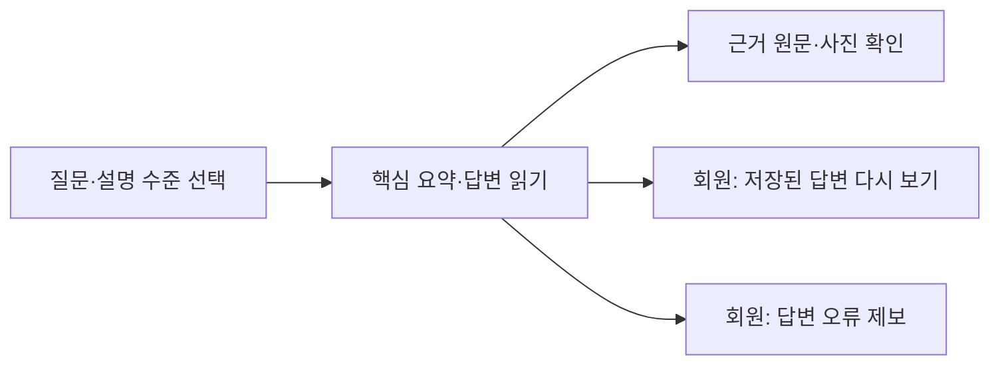
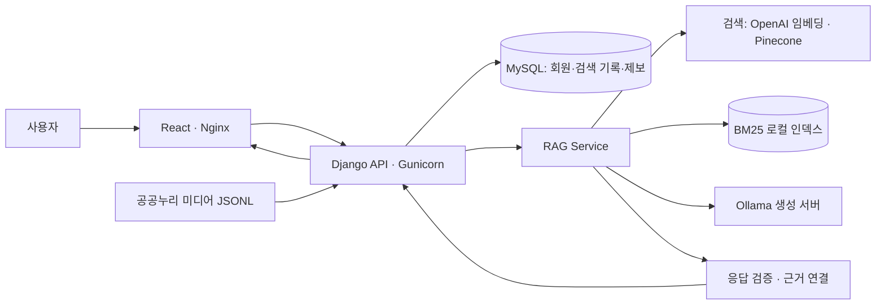

# 개인 맞춤형 AI 문화유산 가이드

> **질문으로 배우고, 원문으로 확인하고, 나의 기록으로 이어가는 문화유산 탐색 서비스**
>
> SKN AI 캠프 4차 프로젝트 · 문서 기준: 2026-09-21

한국의 역사와 문화가 궁금한 사용자를 위한 AI 웹 서비스입니다. 질문에 맞는 한국민족문화대백과사전 자료를 찾아 설명 수준에 맞게 답하고, 근거 원문과 관련 사진을 함께 제공합니다. 회원은 이전 답변을 다시 열어볼 수 있고, 잘못된 내용은 해당 답변과 연결하여 제보할 수 있습니다.

## 1. 무엇을 할 수 있나요?

| 사용자에게 필요한 일 | 서비스에서 제공하는 기능 |
|---|---|
| 어려운 문화유산 정보를 이해하고 싶어요 | 초등학생·중고등학생·성인 일반 중 설명 수준을 선택하여 질문 |
| 답변의 근거를 직접 확인하고 싶어요 | 답변에 사용한 항목명·원문 링크·근거 내용 제공 |
| 문화유산의 모습을 함께 보고 싶어요 | 연결 가능한 사진이 있는 경우 이미지와 출처·이용 조건 표시 |
| 이전에 받은 답변을 다시 보고 싶어요 | 로그인 후 개인 검색 기록에서 저장된 답변 확인 |
| 답변에서 잘못된 내용을 발견했어요 | 저장된 질문·답변에 연결하여 오류 제보 등록 |

‘개인 맞춤형’은 사용자가 설명 수준을 선택하는 기능을 뜻합니다. 관심사 분석 기반 자동 추천은 현재 완료 범위에 포함되지 않습니다. 서비스는 지정 문화재뿐 아니라 인물·사건·사상·문학·예술·민속 등 한국의 역사·문화 지식을 다룹니다.

### 사용 흐름



예를 들어 ‘경복궁 근정전은 어떤 곳인가요?’를 질문하면 선택한 수준의 설명을 읽고, 답변 아래에서 근거 원문을 확인할 수 있습니다. 제공 가능한 사진이 있으면 사진과 출처를 함께 표시합니다.

## 2. 4차 프로젝트의 목표

4차는 **검색과 답변을 일상적으로 사용할 수 있는 웹 서비스로 제공하고, 이용 기록·출처 확인·오류 제보까지 이어지는 사용자 경험을 만드는 것**을 목표로 합니다.

- **서비스 이용:** React·Django 웹과 회원 기능으로 질문부터 답변 재조회까지 연결합니다.
- **정보 확인:** 답변 근거와 사진 출처를 표시하고, 요약·정정·생성 품질을 개선합니다.
- **운영 준비:** 오류 제보를 처리하는 흐름과 Docker·AWS 배포 환경을 갖춥니다.

### 3차에서 출발해 무엇을 개선했나요?

| 영역 | 3차에서 구현한 것 | 남아 있던 과제 | 4차에서 개선·도입한 것 | 현재 단계 |
|---|---|---|---|---|
| 서비스 화면 | Streamlit에서 RAG 질문·답변 시연 | 회원이 지속적으로 이용하는 웹 흐름 필요 | React·Django 웹, 회원가입·로그인, 개인 검색 기록 | main 반영 |
| 검색·근거 | 의미 검색과 BM25 결합, 사용 근거 ID 검증·출처 연결 | 웹 API 통합과 근거 가독성 개선 필요 | RAG 웹 연결, 항목별 원문 링크·펼쳐보는 근거 | main 반영 |
| 답변 품질 | 설명 수준별 생성과 응답 유형 처리 | 잘못된 전제·요약·수준 차이의 검증 및 개선 필요 | 정정 시작 문구 후처리, 완결 문장 요약, 수준별·모델 비교 평가 | 코드·평가 문서 반영; 운영 통합 검증 계속 |
| 답변 구성 | 텍스트·근거 중심 안내 | 사진과 이용 조건을 함께 확인하기 어려움 | 공공누리 미디어 수집·연결, 사진과 답변 배치 | main 반영 |
| 사용자 피드백 | 회원별 제보·처리 서비스는 미구현 | 문제 답변과 사용자 문의를 연결할 필요 | 저장 답변에 귀속된 제보 등록 | 기본 등록 main 반영; 개인 게시판·관리자 처리는 검토 중 |
| 연관 탐색 | 문화유산 네트워크 탐색 | 새 웹 환경 연결과 읽기 쉬운 배치 필요 | 네트워크 API·Docker 연결, 근거 옆 연관 탐색 배치 검토 | PR 검토 중 |
| 실행·배포 | Streamlit·외부 생성 서버 연결 | 웹·DB·모델을 묶은 실행 및 배포 절차 필요 | Docker Compose, AWS 실행, 테스트 후 자동 배포 | main 반영 |

검색 데이터와 RAG 기반은 재사용했습니다. 4차의 성과는 웹 서비스 통합, 사용자 이용 흐름, 미디어·제보 연결과 품질 개선 작업으로 구분합니다. 관련 실험의 성과와 한계는 아래 평가 항목에 정리했습니다.

## 3. 시스템 구성



BM25 인덱스 유무에 따라 Hybrid 또는 Dense 검색을 사용합니다. MySQL은 별도 제공 서버를 사용하며 Compose에 MySQL 서비스는 없습니다. 생성 모델은 `OLLAMA_MODEL`과 실제 Ollama 서버 설정으로 결정합니다. README의 실험 모델명이 운영 모델을 뜻하지 않습니다.

## 4. 팀 역할

| 팀원 | 주요 기여 | 현재 후속 작업 |
|---|---|---|
| 권세진 · 팀장 | 회원·화면 초기안, 오류 제보 기능 실험, 개인 제보 게시판·관리자 처리 | 게시판·관리자 기능 검토 및 통합 |
| 김문규 | 웹·RAG·MySQL 통합, Docker·AWS 실행, CSRF 응답 처리, 자동 배포 | 공용 통합 테스트 환경(#27) 검토, 최종 실행·배포·시연 확인 |
| 김유진 | 공공누리 미디어 데이터·출처·이용 조건, 검색 결과 사진 연결, API·DB 규약 초안 | 데이터·미디어 연결 조건 확인 |
| 이준희 | 요약 문장 개선, 생성 모델 비교·품질 평가, 신규 기준선 제안 | 운영 모델·최신 서비스 통합 검증 |
| 신가을 | Prompt·생성/근거 평가, 정정 후처리, 수준별 비교·LangChain 실험, UI 통합, GitHub·문서 정리 | 정정 표시·UI 시안·연관 탐색 화면 연결 |
| 채수환 | 문화유산 연관 네트워크의 웹·Docker 연결 | 9월 17일 참여 중단 전달; 기존 기여 보존, 후속 유지 담당 협의 |

현재까지 확인한 기여이며 검토 중인 작업을 포함합니다. 개인별 PR·반영 상태와 RAG 관련 후속 수행 내역은 [역할·기여 근거 문서](docs/FOURTH_TEAM_CONTRIBUTIONS.md)에 정리했습니다.

## 5. 품질 개선과 평가

답변의 문장만 다듬는 것에 그치지 않고, 잘못된 질문 전제의 정정, 설명 수준, 근거 충실도와 모델 변경 효과를 비교했습니다.

| 개선·검토 항목 | 수행 내용 | 결과 해석 |
|---|---|---|
| 잘못된 긍정 표현 | 정정 내용이 있는 응답의 시작 문구를 보수적으로 정리 | 후처리 코드 반영; 모든 사실 오류 해결을 의미하지 않음 |
| 핵심 요약 | 글자 제한으로 문장이 잘리는 문제를 완결 문장 중심으로 개선 | 코드 반영; 실제 모델·정정 응답과 통합 확인 필요 |
| 설명 수준 | 동일 질문에서 수준별 답변과 수정 후보 비교 | 비교 결과·미적용 사유 문서화 |
| 모델 비교 | EXAONE과 Qwen의 응답 유형·정정·되묻기·RAGAS 비교 | Qwen 전환 권고 문서 반영; 운영 모델 교체 완료 아님 |
| LangChain·LangGraph | 연결 방식과 품질·호출량·지연 비교 | 실험과 운영 채택을 구분; 개선 효과·비용을 함께 평가 |

평가 수치는 질문 수, 검색 문맥, 모델·프롬프트 조건과 함께 읽어야 합니다. 응답 유형 일치율은 전체 사실 정확도가 아니며, 저장 응답 평가가 실제 웹 통합 검증을 대신하지 않습니다. 상세 결과는 [모델 비교·신규 기준선 제안](https://github.com/SpicyAutumn/SKN33-4th-1Team/pull/19)을 참고하세요.

## 6. 실행 방법

### 준비

Git, Docker Desktop과 팀에서 제공하는 DB·검색·모델 연결 설정이 필요합니다. 실제 답변 생성에는 Ollama 서버가 실행 중이어야 합니다.

```powershell
git clone https://github.com/SpicyAutumn/SKN33-4th-1Team.git
cd SKN33-4th-1Team
```

루트에 비공개 `.env`를 준비합니다. 새로 복제한 폴더에서만 `.env.example`을 복사하며, 기존 `.env`를 덮어쓰지 않습니다. 다음은 확인할 **변수 이름**입니다. 실제 값은 문서·저장소·공유 캡처에 넣지 않습니다.

| 용도 | 확인할 변수 |
|---|---|
| DB | `MYSQL_HOST`, `MYSQL_PORT`, `MYSQL_USER`, `MYSQL_PASSWORD`, `MYSQL_DATABASE` |
| Django | `DJANGO_SECRET_KEY`, `DJANGO_DEBUG`, `DJANGO_ALLOWED_HOSTS`, `DJANGO_COOKIE_SECURE` |
| 검색 | `OPENAI_API_KEY`, `OPENAI_EMBEDDING_MODEL`, `PINECONE_API_KEY`, `PINECONE_INDEX_NAME`, `PINECONE_NAMESPACE` |
| 생성 | `OLLAMA_BASE_URL`, `OLLAMA_MODEL` |

Docker 컨테이너에서 `127.0.0.1`은 해당 컨테이너 자신입니다. Windows 호스트의 SSH 터널에 연결한다면 컨테이너에서 접근할 수 있는 주소·포트를 별도로 확인해야 합니다. PyCharm의 DB 연결 성공만으로 웹 서버 설정까지 완료된 것은 아닙니다.

팀 공유 데이터는 아래 위치에 준비합니다. 대용량 원본은 Git에 추가하지 않습니다.

```text
data/processed/aks_bm25_v1.sqlite3
data/processed/aks_article_medias.jsonl
```

현재 Compose는 두 경로를 읽기 전용으로 연결합니다. 실행 전에 파일인지 확인하세요. 없는 경로가 폴더로 생성되면 정상 파일로 연결되지 않습니다. 인덱스 미사용 시 Dense 검색, 미디어 미사용 시 텍스트 응답을 사용할 수 있지만 Compose 연결 경로도 해당 실행 방식에 맞게 준비해야 합니다.

### 시작·설정 재적용

`docker-compose.yml`이 있는 저장소 루트에서 실행합니다.

```powershell
docker compose up --build -d
docker compose ps
```

- 웹: http://localhost:8081/
- 상태 확인: http://localhost:8081/api/health

환경 변수를 변경한 뒤 컨테이너를 재생성합니다.

```powershell
docker compose up --build -d --force-recreate
```

상태 확인 성공은 실제 검색·회원·전체 DB 테이블의 정상 동작을 보장하지 않습니다. DB 스키마 준비는 담당자와 확인하며 공유 DB에 임의 마이그레이션을 실행하지 않습니다.

```powershell
# 로그는 키·개인정보를 제외하고 필요한 오류만 공유합니다.
docker compose logs --tail 100 backend
# 서비스 종료: 외부 MySQL 데이터는 삭제하지 않습니다.
docker compose down
```

상세 절차: [Docker 실행 안내](docs/DOCKER_RUNBOOK.md). 3차의 `python run.py`는 Streamlit 경로이며 위 React 웹 실행과 구분합니다.

### 병합 전 공용 테스트 — PR #27 검토 중

| 환경 | 목적 | 적용 기준 |
|---|---|---|
| 로컬 실행 | 개인 개발·확인 | 내 PC에서 실행한 코드와 설정 |
| 운영 사이트 | 병합된 서비스 제공 | main 테스트 후 배포(#25) |
| 공용 통합 테스트 | 여러 PR 기능을 함께 확인 | 최신 main + `preview` 라벨이 붙은 같은 저장소의 열린 PR(#27) |

#27은 아직 미병합입니다. PR에 기재된 검증 결과와 상시 자동 반영 여부를 구분하여, 이용 전 Actions 실행 결과를 확인합니다.

공용 테스트 자동화 적용 후에는 다음 흐름으로 확인합니다.

1. 기본 테스트를 마친 개발 PR에 팀에서 `preview` 라벨을 붙입니다. Draft도 포함됩니다.
2. **Common integration test** Actions가 성공했는지 확인합니다.
3. 실행 요약의 테스트 주소와 포함 PR 목록을 확인한 뒤 시연합니다. 주소는 서버 재시작으로 바뀔 수 있습니다.
4. 충돌·배포 실패 시 이전 배포본이 남을 수 있으므로, 화면이 열린다는 이유만으로 최신 변경이 반영됐다고 판단하지 않습니다.

테스트 환경은 별도 EC2·MySQL로 구성되며, 통합 구성이 바뀌면 테스트 계정·검색 기록·오류 제보가 초기화됩니다. 테스트용 계정을 사용하세요. AI 답변 생성에는 테스트 서버의 별도 RAG·Ollama 연결이 필요합니다. 실제 검색 정상 여부는 사이트·상태 확인 API의 HTTP 200과 별도로 확인합니다.

설정과 최신 안내: [공용 통합 테스트 PR #27](https://github.com/SpicyAutumn/SKN33-4th-1Team/pull/27).

## 7. 개발 및 반영 현황

> 확인 기준: 2026-09-21 · main `06145592de939841f9a5da2d4343138ce2045df6`. 병합 상태와 실제 운영 검증 완료는 구분합니다.

| 구분 | 현재 기준 | 근거 |
|---|---|---|
| React·Django 웹, 회원·검색 기록·기본 오류 제보 | main 반영 | PR #12·#13·#22 |
| 수준별 답변·원문 근거 | 기존 RAG를 웹에 연결 | PR #12 |
| 공공누리 미디어 연결 | main 반영, 미디어 파일과 연결 설정 필요 | PR #16 |
| UI 배치·사진 답변·개인 기록 | main 반영 | PR #22 |
| 완결 문장 중심 핵심 요약 | main 반영, 최종 서비스 회귀 확인 필요 | PR #15 |
| Qwen 27B 비교·전환 권고 | **실험 문서 병합**, 운영 모델 전환 완료 아님 | PR #19 |
| main 테스트 후 EC2 배포 | 자동 배포 구성 반영 | PR #25 |
| 병합 전 공용 통합 테스트 | 전용 테스트 서버·DB와 preview 라벨 기반 통합 배포 제안, PR 검토 중 | PR #27 |
| 오류 제보 게시판·관리자 처리 | PR 검토 중 | PR #24 |
| 지도 로딩·오류 제보 개선 시안 | Draft, 일부 기능 테스트 전용 | PR #23 |
| 정정·요약·전체 설명 표시 개선 | Draft, 현재 UI와 통합 필요 | PR #18 |
| 문화유산 연관 네트워크 | PR 검토 중, 현재 UI와 통합 필요 | PR #17 |

PR 상태는 바뀔 수 있으므로 [최신 PR 목록](https://github.com/SpicyAutumn/SKN33-4th-1Team/pulls)을 함께 확인합니다.

## 8. 발표·최종 제출 전 확인

| 확인할 항목 | 완료 기준 |
|---|---|
| 기능 범위 | 미병합 PR·테스트 전용 시안을 완료 기능과 구분 |
| 실제 시연 | 로그인 → 질문 → 답변·사진·근거 → 저장 기록 재조회 확인 |
| 공용 테스트 | Actions 성공 여부·포함 PR·접속 주소 확인, 초기화된 테스트 계정 준비 |
| 오류 제보 | 현재 입력 규칙으로 등록 확인, #24 병합 시 본인 내역·관리자 처리까지 확인 |
| 모델·품질 | 실제 운영 모델과 평가 조건 확정, 대표 질문과 실패 사례 확인 |
| UI | 모바일·태블릿, 긴 제목·출처, 사진 없음, 검색 실패 상태 확인 |
| 제출 문서 | README·아키텍처·발표 자료·테스트 보고서의 기준 커밋 통일 |
| 파일·산출물 | 최종 단계에서만 불필요 파일 분류, ZIP·체크섬·제출 목록 확정 |

최종 공동 기여와 후속 인계 담당, 최종 시연 결과는 팀 확인 후 갱신합니다. 파일 재배치와 제출 산출물 확정은 최종 단계에서 진행합니다.

## 9. 문서와 자료 이용

- [Docker 실행 안내](docs/DOCKER_RUNBOOK.md)
- [4차 출발 기준과 재사용 범위](docs/FOURTH_PROJECT_BASELINE.md)
- [자동 배포 안내 — 확인 기준 커밋](https://github.com/SpicyAutumn/SKN33-4th-1Team/blob/06145592de939841f9a5da2d4343138ce2045df6/docs/MAIN_AUTO_DEPLOY.md)
- [UI 시안과 캡처 — PR #23](https://github.com/SpicyAutumn/SKN33-4th-1Team/pull/23)
- [협업 규칙](CONTRIBUTING.md)

텍스트 원문 출처와 사진의 개별 이용 조건을 구분합니다. `.env`, 인증 정보, 개인정보와 대용량 원본은 제출·공유 대상에서 제외합니다. main에는 자동 배포가 연결되어 있으므로 병합 전 검토를 마칩니다.

---

### 이전 프로젝트 참고

4차는 3차의 데이터·검색·생성 기반을 이어서 개발했습니다. 당시 역할, 실험 결과, Streamlit 실행 방법과 제출 이력은 원본 저장소에서 확인할 수 있습니다.

- [3차 프로젝트 저장소](https://github.com/SpicyAutumn/SKN33-3rd-1Team)
- [4차 출발 시점의 3차 README](https://github.com/SpicyAutumn/SKN33-3rd-1Team/blob/18b88da95d77eb07c5055dd2769f215df7024bb0/README.md)
- [4차 재사용 범위와 출발 기준](docs/FOURTH_PROJECT_BASELINE.md)
