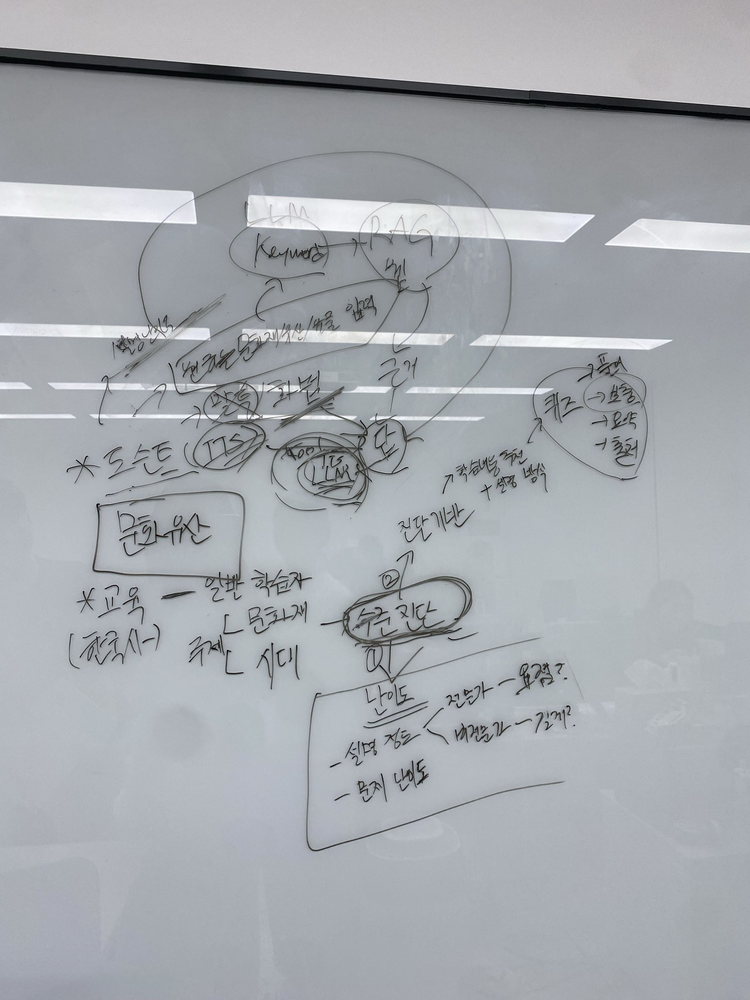

# 3차 단위 프로젝트 주제 의견 요청 및 후속 팀 논의 기록

> **진행일:** 2026-08-26<br>
> **진행 시각:** 18:00 이후<br>
> **기록 성격:** 2차 회의 후 구체화한 예비후보 3건에 대해 강사님께 의견을 구하고 이어서 진행한 팀 논의 기록<br>
> **문서 상태:** 2026-08-26 당시 기록 보존 — 2026-08-28 후속 진행 참고 추가<br>
> **당시 방향:** `(가칭) 개인 맞춤형 AI 문화유산 도슨트`로 팀 의견이 모였으나, 주제명·MVP·세부 설계는 확정하지 않음

> [!IMPORTANT]
> 이 문서는 팀이 강사님께 조언을 구하고 팀원들이 후속 의견을 나눈 과정을 보존하기 위한 기록이다. 프로젝트의 선정·설계·실행 주체는 팀이며, 강사님의 `추천`, `흥미로움` 의견이나 팀의 `결합 가능`, `의견이 모임` 표현은 최종 선정·설계 확정을 뜻하지 않는다. 후보명은 모두 가칭이며, 파일명의 숫자는 기존 문서 작성 순서일 뿐 강사님께 설명한 순서와 다르다.

---

## 1. 진행 목적과 기록 범위

2026-08-26 13:30 2차 회의 후 정리한 세 가지 예비후보를 강사님께 설명하고, 프로젝트 기간·기술 범위·사용자 경험 측면의 의견을 요청했다. 이후 팀이 간략히 의견을 나누어 현재의 잠정 방향을 정리했다.

이번 문서에서는 다음 내용까지만 기록한다.

- 예비후보별 강사 의견
- 주제명과 기능 범위에 관한 개인 의견
- 강사 의견 청취 후 팀의 잠정 방향
- 아직 확정하지 않은 사항과 다음 예정 단계

팀원별 담당 임무 설정, 최종 주제명 확정, MVP 설계와 데이터 수집 계획 수립은 이 기록 이후 별도로 진행한다.

## 2. 참고자료와 실제 설명 순서

| 실제 설명 순서 | 예비후보(가칭) | 기존 문서 | 비고 |
|---:|---|---|---|
| 1 | 개인 성향 기반 홈 리셋 코치 | [HTML 제안서](../03_post_meeting_reviews/home_reset_ai_project_proposal.html) | 현 프로젝트에서는 우선 제외, 향후 개인 프로젝트 후보로 보존 |
| 2 | 교육자·출제자 중심성을 제거한 문화유산 기반 한국사 교육 | [Markdown](../03_post_meeting_reviews/post_meeting_topic_2_heritage_learning_companion.md) · [HTML](../03_post_meeting_reviews/post_meeting_topic_2_heritage_learning_companion.html) | 기존 파일명에서는 `주제 보완안 2` |
| 3 | 방문 도우미 + 개인 맞춤형 AI 문화유산 여행 도슨트 | [Markdown](../03_post_meeting_reviews/post_meeting_topic_1_heritage_travel_docent.md) · [HTML](../03_post_meeting_reviews/post_meeting_topic_1_heritage_travel_docent.html) | 기존 파일명에서는 `주제 보완안 1` |

> 설명 순서는 후보의 확정 순위가 아니다. 강사님께서 제시한 의견과 후속 팀 의견은 아래에서 별도로 기록한다.

## 3. 예비후보별 강사 의견

### 3.1. 실제 설명 순서 1 — 개인 성향 기반 홈 리셋 코치

#### 강사 의견

- 주제 자체는 흥미롭다.
- 텍스트 입력보다는 사용자가 공간을 사진으로 촬영하여 접근하는 방식이 더 자연스럽고 용이할 수 있다.
- 그러나 사진 기반 접근은 이미지 분석이 필요하며, 현재 프로젝트 기간과 여건을 고려하면 시간과 비용 부담이 크다.
- 현 3차 프로젝트에서는 우선 제외하고, 향후 개인 프로젝트 주제로 저장해 두는 방향을 추천했다.

#### 기록상 해석

이 후보는 주제 가치가 부족해 폐기한 것이 아니라, **사용자에게 자연스러운 핵심 경험이 이미지 분석을 요구하는 반면 현재 프로젝트 제약과 맞지 않아 보류한 것**으로 기록한다.

**현재 상태:** `현 3차 프로젝트 우선 제외 · 향후 개인 프로젝트 후보로 보존`

---

### 3.2. 실제 설명 순서 2 — 문화유산 기반 한국사 교육

#### 강사 의견

- 세 후보 가운데 현 프로젝트 주제로 가장 추천했다.
- 사용자 흐름이 어느 정도 완성된 상태로 보인다는 의견이었다.
- 사용자가 서비스를 이용할 때마다 수준 진단을 반복하면 재사용 의사가 낮아질 수 있다는 우려가 제시됐다.
- 수준 진단과 퀴즈 결과를 다음 이용 시 갱신·반영하려면 로그인과 MySQL 등 사용자별 학습상태 저장 방식도 검토해야 할 수 있다.
- 저장 기능을 크게 만들지 않는 대안으로, 최초 화면에서 사용자가 설명 대상과 난도를 직접 선택하는 방식이 제안됐다.

#### 강사 제안 화면 예시

```text
대상 선택: 초등 / 중·고등 / 성인
       ↓
설명 깊이: 일반 / 핵심 / 심화
       ↓
선택 결과에 맞춰 설명 난이도와 분량 반영
```

> 위 선택지는 화면 흐름을 설명하기 위한 예시이며, 사용자 분류나 난도 명칭을 확정한 것이 아니다.

#### 검토가 필요한 선택지

| 선택지 | 장점 | 추가 부담 |
|---|---|---|
| 이용할 때마다 수준 진단 | 현재 수준을 매번 반영 가능 | 반복 피로로 재사용성이 낮아질 수 있음 |
| 로그인 후 학습상태 저장 | 퀴즈 결과와 난도 변화를 누적 가능 | 사용자 인증·DB·개인정보·상태관리 범위가 추가됨 |
| 최초 화면에서 수준 직접 선택 | MVP 구현이 단순하고 즉시 이용 가능 | 장기 개인화와 학습 이력 반영은 제한됨 |

**현재 상태:** `강사 의견에서 상대적으로 추천됨 · 후속 팀 논의에서 도슨트와 결합 가능성 검토`

---

### 3.3. 실제 설명 순서 3 — 방문 도우미 + 문화유산 여행 도슨트

#### 강사 의견 및 후속 팀 논의에서 확인한 방향

- 방문·여행 계획 도우미와 문화유산 도슨트를 연결할 수 있다고 보아 결합했으나, 기능 결합이 오히려 핵심인 `도슨트`를 흐리게 할 수 있다는 의견이 제시됐다.
- 이에 따라 방문 계획 전반보다 `AI 문화유산 도슨트`를 중심으로 다시 정리하는 방향을 검토했다.
- 도슨트 기능 하나만으로는 서비스 구성이 단조로울 수 있으므로, 핵심을 해치지 않는 보완 기능을 고민할 필요가 있다.

#### 제시된 보완 예시

- 도슨트 설명에 여러 화법 또는 표현 방식을 적용
- 버츄얼 도슨트
- 문화유산 기반 퀴즈 학습
- 거리·지역을 기준으로 한 주변 문화유산 추천
- 현재 보고 있는 문화유산과 유사한 유형의 문화유산 추천

#### 별도 개인 의견

결합 과정에서 주제명을 더 깊이 고민했어야 하지 않았는지에 대한 아쉬움이 제시됐다. `문화유산 여행 도우미` 같은 표현이 예시로 언급됐으나, 이는 명칭 확정안이 아니다.

**현재 상태:** `방문 도우미 범위를 축소하고 도슨트 중심으로 재정리 검토`

---

## 4. 강사 의견 청취 후 팀의 간략 논의

### 4.1. 잠정 방향

프로젝트 방향은 **`(가칭) 개인 맞춤형 AI 문화유산 도슨트`**로 의견이 모였다.

다만 현재 확인된 것은 중심 방향이며, 다음 사항은 아직 확정하지 않았다.

- 최종 프로젝트명
- 대상 기관·지역·시대·문화유산 범위
- 핵심 사용자와 개인화 기준
- MVP 포함 기능과 확장 기능
- 로그인·MySQL 등 사용자 상태 저장 여부
- 버츄얼 도슨트 구현 방식
- 퀴즈·추천 기능의 우선순위

### 4.2. 교육 주제와의 결합 가능성

- 교육 후보와 도슨트 후보는 `문화유산`이라는 중심 요소를 공유한다.
- 두 후보는 완전히 다른 주제라기보다 사용자 경험과 구현 방식의 차이로 볼 수 있어, 교육 후보에서 검토한 수준별 설명·퀴즈·학습 요소를 도슨트에 결합할 수 있다는 의견이 있었다.
- 현 3차 프로젝트에서는 도슨트에 집중하고, 차후 4차 프로젝트에서 사용자 상태 저장이나 학습 순환 등으로 확장하는 방안도 고려할 수 있다.

### 4.3. 버츄얼 도슨트와 퀴즈 연계 아이디어

퀴즈 학습 결과에 따라 버츄얼 도슨트가 변경되는 아이디어가 제시됐다.

```text
퀴즈 결과 또는 학습 단계
        ↓
버츄얼 도슨트 역할·캐릭터 변화
        ↓
예시: 세종대왕 → 신하 → … → 노비
```

> 위 인물·신분 변화는 회의에서 나온 아이디어 예시이며, 실제 보상 체계·표현 방식·역사적 적절성을 검토하거나 확정한 결과가 아니다.

### 4.4. 문화유산 추천 방식

추천은 사용자 위치 사용 여부에 따라 다음 두 방식이 가능하다는 의견이 있었다.

| 이용 상황 | 추천 기준 예시 |
|---|---|
| 경복궁 등 문화유산 현장에서 이용 | 현재 위치와 관람 동선을 바탕으로 인근 문화유산 추천 |
| 현장 방문 전 또는 위치정보 미사용 | 검색한 문화유산의 인근 장소 또는 유사한 유형 추천 |

위 기능은 구현 확정이 아니라, 도슨트 중심 서비스를 보완할 수 있는 후보 기능으로 기록한다.

## 5. 화이트보드 기록



화이트보드 사진은 당시 논의 맥락을 보존하는 보조자료다. 반사와 필기 중첩으로 일부 내용을 정확히 판독하기 어려우므로, 본문의 사용자 제공 기록을 우선하며 사진에서 불명확한 문구를 임의로 해석하지 않는다.

## 6. 2026-08-26 당시 상태표

| 항목 | 현재 기록 | 확정 여부 |
|---|---|---|
| 중심 방향 | 개인 맞춤형 AI 문화유산 도슨트 | `잠정 방향` |
| 주제명 | `(가칭) 개인 맞춤형 AI 문화유산 도슨트` | `미확정` |
| 홈 리셋 코치 | 현 프로젝트 우선 제외, 개인 프로젝트 후보로 보존 | `현 단계 보류` |
| 교육 요소 | 수준별 설명·퀴즈 등 도슨트 결합 가능성 검토 | `미확정` |
| 방문 도우미 | 도슨트를 흐리지 않도록 범위 축소 검토 | `미확정` |
| 로그인·MySQL | 지속적 수준 진단을 선택할 경우 필요한 대안 | `미확정` |
| 버츄얼 도슨트 | 보완 기능 아이디어 | `미확정` |
| 위치·유사 문화유산 추천 | 보완 기능 아이디어 | `미확정` |
| 팀원별 담당 임무 | 다음 단계에서 설정 예정 | `미정` |
| 구체 설계 | 담당 임무 설정 후 진행 예정 | `미착수` |

## 7. 당시 예정 단계

이 기록을 팀원이 확인한 후 다음 순서로 진행할 예정이다.

1. 누락되거나 다르게 이해한 강사·팀 의견 현행화
2. 팀원별 담당 임무 설정
3. 가칭 주제의 문제·핵심 사용자·사용 시나리오 구체화
4. 도슨트 중심 MVP와 교육·추천 등 확장 기능 분리
5. 대상 기관과 데이터 범위 확정
6. 시스템 구조와 구현 계획 수립

> 이 절은 예정 절차를 기록한 것이며, 본 문서 작성 시점에 담당자·기한·세부 설계를 확정했다는 의미가 아니다.

## 8. 후속 진행 참고

> **후속 기준일:** 2026-08-28  
> 이 절은 2026-08-26 회의 내용을 수정하는 것이 아니라, 이후 진행된 사항을 구분하여 안내하기 위한 참고 기록이다.

이후 팀 회의와 검토를 거쳐 다음 사항이 진행되었다.

- 현장 도슨트에 한정하지 않고 집·야외 등에서도 이용할 수 있는 **RAG 기반 AI 문화유산 지식 안내 서비스** 방향으로 구체화
- 팀장 및 팀원 A~F의 주요 임무 분담 완료
- 한국민족문화대백과사전을 기본 데이터 출처로 선택
- 설명 수준을 `쉽게`, `일반`, `깊이 있게`의 단일 축으로 구성
- 검색 근거에 기반한 답변, 출처 표시, 근거 부족 시 답변 보류를 핵심 서비스 흐름으로 정리
- Prompt Baseline과 Fine-tuning을 같은 조건에서 비교하고, 결과에 따라 Fine-tuning을 채택하지 않을 수도 있다는 원칙 채택
- 팀원 D는 Prompt·Fine-tuning 생성 후보와 오프라인 비교를, 팀원 E는 서비스 RAG Chain·근거 판정·안전장치·통합 평가를 주로 담당하도록 경계 정리
- 프로젝트 방향 정리안을 작업 기준안 `v0.1`로 채택하되, 후속 데이터 검증·Baseline 실험·팀 회의 결과에 따라 변경 가능하도록 관리

최신 팀 구성과 프로젝트 개요는 저장소 루트 [README](../../../README.md)를 따르며, 생성·Fine-tuning 관련 최신 역할과 계약은 다음 문서를 참고한다.

- [Track B 역할 및 업무 범위](../../../docs/track_b/01_role_and_scope.md)
- [생성 컴포넌트 입출력 계약](../../../docs/track_b/02_generation_contract.md)
- [Prompt Baseline 설계](../../../docs/track_b/03_prompt_baseline.md)

위 후속 내용 역시 최종 서비스명과 모든 기능이 확정되었다는 의미는 아니다. 세부 MVP, 실제 데이터 범위, 평가 기준과 Fine-tuning 채택 여부는 이후 검증 결과에 따라 조정할 수 있다.
