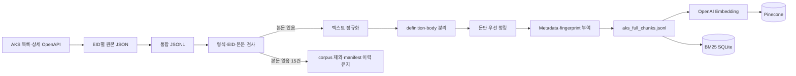

# 수집 데이터 및 데이터 전처리 보고서

> 문서 기준일: 2026-09-03
>
> 적용 대상: SKN 33기 3차 프로젝트 `개인 맞춤형 AI 문화유산 가이드`
>
> 기준 코드: `main` commit `f38ac05`
>
> 데이터 제공 기관: 한국학중앙연구원(AKS)

## 1. 목적과 범위

한국민족문화대백과사전의 텍스트 원문을 수집·정제·청킹하여 Dense·BM25·Hybrid 검색과 RAG 답변 생성에 사용할 수 있는 형태로 준비한다.

- 포함 범위: 항목 제목, 정의, 본문, 분야·시대·유형·별칭·수정일과 출처 URL
- 포함 기준: manifest의 `has_body=true`, `status=ok`
- 제외 기준: 본문이 없는 항목, 잘못된 EID, JSON 파싱 실패와 수집 실패 항목
- 제외 자료: 이미지·영상·음성 등 권리 조건을 별도로 확인해야 하는 미디어
- OCR: OpenAPI가 텍스트를 직접 제공하므로 적용하지 않음

## 2. 데이터 출처와 이용 조건

| 항목 | 내용 |
| :--- | :--- |
| 제공 기관 | 한국학중앙연구원(AKS, Academy of Korean Studies) |
| 서비스 | 한국민족문화대백과사전 |
| 목록 API | `GET https://devin.aks.ac.kr:8080/api/articles?p={pageNo}&ps={pageSize}` |
| 상세 API | `GET https://devin.aks.ac.kr:8080/api/articles/{eid}` |
| 인증 | 요청 헤더 `X-API-Key`; 실제 키는 `.env`에만 저장 |
| 수집일 | 2026-08-28~2026-08-29 |
| 원문 이용 | 항목 원고는 출처 표기 조건을 확인해 사용 |
| 미디어 | 항목별 권리 조건이 달라 이번 corpus에서 제외 |

서비스에서는 다음 형식으로 출처를 표시한다.

```text
출처: [항목명] - 한국민족문화대백과사전 (한국학중앙연구원)
```

원본 JSON·JSONL과 전체 청크 파일은 용량과 이용 조건 때문에 Git에 올리지 않고 팀 공유 저장소와 최종 제출용 데이터 ZIP에서 관리한다.

## 3. 최종 데이터 구성

### 3.1 파일 기준

최종 제출물에서는 파일명을 다음과 같이 통일한다.

| 구분 | 최종 파일명 | 형식 | 상태 |
| :--- | :--- | :--- | :---: |
| 상세 API 원본 통합본 | `aks_full_content.jsonl` | JSONL | 팀 공유 저장소 보관 |
| 원본 추적표 | `manifest.csv` | CSV | Git·팀 공유 저장소 보관 |
| 전체 청크 전달본 | `aks_full_chunks.jsonl` | JSONL | 팀 공유 저장소 보관 |
| 원본 검증 결과 | `aks_raw_validation.json` / `.md` | JSON·Markdown | Git 보관 |
| 전체 청크 검증 결과 | `aks_full_chunks_validation.json` | JSON | 제출 전 원본과 함께 보관 필요 |

기존 문서나 개인 작업 파일에 남아 있는 `encykorea_full_75835_clean.jsonl`, `aks_chunks.jsonl` 등의 명칭은 같은 데이터 계열의 이전 이름이다. 제출본과 실행 안내에서는 위 최종 파일명만 사용한다.

### 3.2 수량과 용량

| 구분 | 결과 |
| :--- | ---: |
| 상세 API 원본 JSON | 75,835건 |
| 원본 JSONL | 75,835행 |
| 원본 JSONL 파싱 오류 | 0건 |
| 중복 EID | 0건 |
| 본문이 없어 제외한 문서 | 15건 |
| 최종 포함 문서 | 75,820건 |
| 최종 청크 | 179,028건 |
| 원본 JSONL 기록 용량 | 620,482,345 bytes |
| manifest | 51,158,587 bytes |

최종 제출본을 재검증한 결과는 다음과 같다. `data/processed`, 전달받은 사본과 BM25 manifest가 같은 청크 체크섬을 가리키는 것도 확인했다.

| 파일 | 크기 | SHA-256 |
| :--- | ---: | :--- |
| `aks_full_content.jsonl` | 620,482,345 bytes | `aa9e8c1345609e1d648f74f48ef07d1892c7cb08c0873a3f350317909921c0d7` |
| `aks_full_chunks.jsonl` | 371,158,516 bytes | `444d9fc8e8da5c845610d0a960a43ef04152dd525087e659c511b72382b317e0` |
| `manifest.csv` | 51,158,587 bytes | `2bf7e2752216e6fc17ce1ca41e8afecbd9bc9a4acf11a811ec5c978d6073b79f` |

## 4. 전처리 파이프라인



### 단계별 처리

1. 목록 API에서 EID를 수집하고 상세 API 원본을 EID별 JSON으로 저장한다.
2. 상세 JSON을 한 줄에 한 항목인 `aks_full_content.jsonl`로 합친다.
3. JSON 형식, EID 일치, 중복, 본문 존재와 체크섬을 검사해 manifest에 기록한다.
4. Unicode NFC, HTML entity, CRLF, Markdown 링크·제목과 과도한 공백을 정리한다.
5. `definition`과 `body`를 섞지 않고 각각 별도 `section`으로 유지한다.
6. 빈 줄 기준 문단을 우선 보존하고, 너무 긴 문단만 문장·공백 경계에서 분할한다.
7. 필수 검색·출처 필드와 원문·청킹 fingerprint를 부여한다.
8. manifest의 대상 문서와 청크 파일이 완전히 일치하는지 검증한다.

## 5. 청킹 기준과 선택 근거

### 5.1 기본 설정

| 설정 | 값 | 설명 |
| :--- | ---: | :--- |
| 최대 길이 | 1,500자 | 문맥과 검색 정밀도의 기본선 |
| overlap | 200자 | 1,500자를 넘는 긴 단일 문단을 나눌 때 적용 |
| 최소 내용 길이 | 20자 | 지나치게 짧은 section 제외 |
| 본문 필수 | `true` | `body`가 없는 문서는 corpus에서 제외 |
| section | `definition`, `body` | 짧은 정의와 상세 설명을 분리 |
| 현재 청킹 코드 버전 | `v2` | 청킹 설정 fingerprint를 ID·metadata에 포함 |

### 5.2 1만 건 길이 분석

정규화된 `body`가 있는 9,998건의 길이를 분석했다. 약 80.3%가 1,500자 이하이므로, 대부분 문서를 하나의 넓은 문맥으로 유지하면서 장문만 나누는 기본선으로 1,500자를 선택했다.

| 본문 길이 | 결과 |
| :--- | ---: |
| 중앙값 | 769자 |
| 75백분위 | 1,292자 |
| 90백분위 | 2,283자 |
| 95백분위 | 3,545자 |
| 최댓값 | 67,548자 |
| 1,000자 이하 | 6,311건 (63.1%) |
| 1,500자 이하 | 8,032건 (80.3%) |
| 2,000자 이하 | 8,768건 (87.7%) |

### 5.3 후보 조건

| 실험 ID | 최대 길이 | overlap | 1만 건 기준 청크 수 | 3차 프로젝트 상태 |
| :--- | ---: | ---: | ---: | :--- |
| CH-01 | 1,000자 | 150자 | 28,705 | 후보 생성, 공식 비교 미완료 |
| CH-02 | 1,500자 | 200자 | 24,030 | 전체 179,028청크 기준으로 채택 |
| CH-03 | 2,000자 | 200자 | 22,171 | 후보 생성, 공식 비교 미완료 |
| CH-04 | 1,500자 | 0자 | 24,025 | 후보 생성, 공식 비교 미완료 |

CH-02는 현재 서비스의 고정 기본선이며 모든 후보 가운데 최적임을 입증한 결과는 아니다. 청킹 조건별 Recall@K·MRR·저장량·응답 품질 비교는 후속 과제로 남긴다.

## 6. 최종 저장 청크 계약

```json
{
  "chunk_id": "aks:E0002452:3fa52c9018ab:9d1e2f3a4b5c:body:0001",
  "document_id": "aks:E0002452",
  "title": "경복궁 향원정",
  "content": "향원정은 왕과 가족의 휴식처로 이용되었다.",
  "source_url": "https://encykorea.aks.ac.kr/Article/E0002452",
  "section": "body",
  "metadata": {
    "eid": "E0002452",
    "field": "예술·체육/건축",
    "era": "조선/조선 후기",
    "primary_type": "유적/건물",
    "secondary_type": null,
    "contents_type": "유적/건물",
    "aliases": [],
    "last_modified_at": "2023-02-07T08:15:00.847",
    "license": "출처 표기 필수",
    "document_fingerprint": "3fa52c9018ab",
    "chunking_fingerprint": "9d1e2f3a4b5c",
    "chunk_id_schema_version": "v2",
    "chunking_version": "v2",
    "chunking_max_chars": 1500,
    "chunking_overlap_chars": 200
  }
}
```

### 필드 규칙

| 필드 | 자료형 | 규칙 |
| :--- | :--- | :--- |
| `chunk_id` | `str` | 비어 있지 않은 청크 고유 ID |
| `document_id` | `str` | `aks:{eid}` 형식의 원문 ID |
| `title` | `str` | 비어 있지 않은 원문 제목 |
| `content` | `str` | 생성과 Citation에 사용할 원문 근거 |
| `source_url` | `str \| null` | AKS 원문 URL, 값이 없으면 `null` |
| `section` | `definition \| body \| null` | 원문 안의 구역 |
| `metadata.aliases` | `list[str]` | 별칭이 없으면 `[]` |
| 선택 metadata | `str \| null` | 빈 문자열과 `"NONE"`은 검색 반환 시 `null`로 정규화 |

AKS는 웹 문서이므로 페이지 번호를 사용하지 않는다. 저장 청크와 `RetrievedContext` 모두 `page`를 포함하지 않고 `source_url`을 사용한다.

## 7. 임베딩 입력과 검색 원문 분리

임베딩 입력에는 검색 성능을 위해 다음 정보를 조합한다.

```text
제목 + section + era + primary_type + aliases + content
```

`embedding_text` 문자열 자체는 Pinecone에 저장하지 않고 벡터만 저장한다. 사용자의 답변 근거와 Citation에는 부가 문자열이 섞이지 않은 `content`를 사용한다.

- 임베딩 모델: `text-embedding-3-small`
- 차원: 1,536
- 거리 기준: cosine similarity
- 임베딩 입력 버전: `v2-title-section-era-primary-type-aliases-content`

## 8. v1 서비스 DB와 v2 청킹 코드 구분

현재 서비스는 Pinecone `aks-rag-v1`의 기본 namespace `__default__`에 적재된 **v1 청크 179,028개**를 사용한다. 현재 코드의 v2 청킹 결과를 같은 namespace에 추가 적재하지 않는다.

| 구분 | 현재 서비스 v1 DB | 현재 청킹 코드 v2 |
| :--- | :--- | :--- |
| 서비스 사용 | 사용 중 | 전체 재적재하지 않음 |
| 청크 수 | 179,028 | 같은 기본 설정이면 본문 내용·수량이 사실상 동일 |
| `document_fingerprint` | 있음 | 있음 |
| `chunking_fingerprint` | 없음 | 있음 |
| 설정 변경 ID 충돌 방지 | 제한적 | 청킹 설정을 fingerprint와 ID에 포함 |

Retriever Adapter는 v1 metadata의 `source` 또는 `source_url`을 최종 `source_url`로 정규화한다. v1에 없는 `metadata.chunking_fingerprint`는 `null`로 반환한다. 따라서 현재 RAG 서비스는 DB 재적재 없이 최신 `RetrievedContext` 계약을 사용한다.

향후 v2로 전환할 경우에는 새 namespace에 전체 적재하고 검색 검증을 마친 뒤 서비스 namespace를 바꾼다. v1과 v2를 같은 namespace에 섞지 않는다.

## 9. 검증 결과

### 9.1 원본 검증

| 검증 항목 | 결과 | 판정 |
| :--- | ---: | :---: |
| 상세 원본 JSON | 75,835건 | PASS |
| 정상 corpus 대상 | 75,820건 | PASS |
| 본문 누락 | 15건, corpus에서 제외 | PASS |
| JSON 파싱 오류 | 0건 | PASS |
| 중복 EID | 0건 | PASS |
| JSONL 누락 EID | 0건 | PASS |

### 9.2 전체 청크 검증

| 검증 항목 | 결과 | 판정 |
| :--- | ---: | :---: |
| 최종 문서 | 75,820건 | PASS |
| 최종 청크 | 179,028건 | PASS |
| 잘못된 JSON·필수 필드 | 0건 | PASS |
| 빈 청크 | 0건 | PASS |
| 중복 청크 ID | 0건 | PASS |
| manifest 대상 문서 누락 | 0건 | PASS |
| 제외 대상의 잘못된 포함 | 0건 | PASS |

검증기는 `chunk_id`, `document_id`, `title`, `content`, `source_url`, `section`, `metadata`의 존재와 자료형을 확인한다. 제출용 `aks_full_chunks_validation.json`에는 입력 청크 파일과 manifest의 경로·파일 크기·SHA-256·검사 시각을 기록했다.

### 9.3 검색 확인

전체 v1 DB의 대표 검색과 최신 Hybrid 평가는 다음 결과를 확인했다.

- `길쌈노래에 대해 설명해줘`: 같은 원문의 definition·body 청크가 top-3에 포함
- Dev 25문항: Dense Hit@3 `0.88`, Hybrid Hit@3 `0.92`
- 고유명사 회귀 5문항: Hybrid Hit@1·Hit@3 `1.00`

검색 평가의 상세 조건과 실패 사례는 `docs/hybrid_retrieval_evaluation_report.md`와 `docs/named_heritage_retrieval_regression_report.md`에서 관리한다.

## 10. 재현 방법

```powershell
# 1. 팀 공유 저장소의 상세 원본 JSONL로 전체 청크 생성
python scripts/build_aks_chunks.py `
  --input data/raw/aks_full_content.jsonl `
  --output data/processed/aks_full_chunks.jsonl `
  --report outputs/aks_chunking_report.json

# 2. manifest와 전체 청크의 구조·문서 일치·체크섬 검증
python scripts/validate_aks_chunks.py `
  --input data/processed/aks_full_chunks.jsonl `
  --manifest data/manifest.csv `
  --report outputs/aks_full_chunks_validation.json

# 3. 외부 API 호출 없이 인덱싱 입력 확인
python scripts/index_aks_pinecone.py `
  --input data/processed/aks_full_chunks.jsonl `
  --dry-run

# 4. BM25 인덱스 생성
python scripts/build_aks_bm25.py --force

# 5. 현재 서비스의 Hybrid 검색 확인
python scripts/search_hybrid_aks.py "경복궁에 대해 알려줘" --top-k 3
```

전체 Pinecone 재적재는 3차 프로젝트 제출 재현 과정에 포함하지 않는다. 비용·쓰기 한도·v1/v2 namespace 정책을 확인한 뒤 별도 승인하에 수행한다.

일부 스크립트의 기본 경로에는 이전 이름인 `aks_chunks.jsonl`이 남아 있으므로, 제출 재현 시에는 위와 같이 `--output`과 `--input`을 명시해 최종 파일명 `aks_full_chunks.jsonl`을 사용한다.

## 11. 한계와 후속 보완

| 현재 한계 | 영향 | 후속 보완 |
| :--- | :--- | :--- |
| 청킹 후보 CH-01~04 공식 비교 미완료 | CH-02가 최적값이라고 단정할 수 없음 | 동일 Dev·Holdout에서 Recall@K·MRR·답변 품질 비교 |
| 현재 서비스 DB는 v1 | v2 청킹 설정 추적 정보를 모두 활용하지 못함 | 새 namespace에 v2 전체 적재 후 단계적 전환 |
| 텍스트만 사용 | 이미지·영상·음성 정보를 답변에 활용하지 못함 | 항목별 이용 조건 확인 후 멀티모달 검토 |
| 문서 수정 시점 자동 반영 없음 | 최신 변경 내용이 즉시 반영되지 않음 | `last_modified_at` 비교와 변경 문서 재수집 |
| 원본·청크 파일이 Git에 없음 | 새 환경에서 별도 전달 없이는 전체 재현이 어려움 | 제출 ZIP에 파일·체크섬·배치 방법 포함 |

## 12. 제출 ZIP 확인 결과

- [x] `aks_full_content.jsonl`의 실제 파일 크기와 SHA-256 기록
- [x] `aks_full_chunks.jsonl`의 실제 파일 크기와 SHA-256 기록
- [x] `aks_full_chunks_validation.json` 재생성 및 PASS 확인
- [x] manifest와 청크 대상 문서가 75,820건으로 일치하는지 확인
- [x] 원본 75,835건·제외 15건·청크 179,028건 수치를 README와 PDF에 동일하게 표기
- [x] 미디어 파일과 실제 API 키가 ZIP에 포함되지 않았는지 확인
- [x] 초기 10,000건 pilot 결과를 전체 결과와 구분

## 13. 관련 문서

- `docs/document-card.md`: 원본 출처·보관·이용 조건
- `docs/retrieved_context_contract.md`: 검색 반환 계약과 v1 Adapter
- `docs/hybrid_retrieval_evaluation_report.md`: Dense·BM25·Hybrid 평가
- `docs/named_heritage_retrieval_regression_report.md`: 고유명사 회귀 평가
- `outputs/aks_raw_validation_report.md`: 원본 전체 검증 결과
