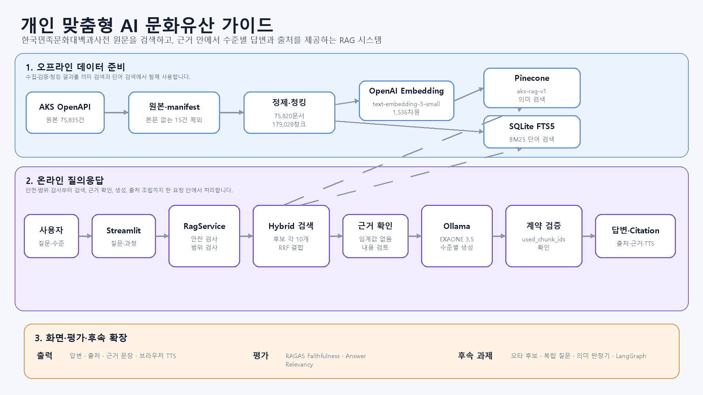
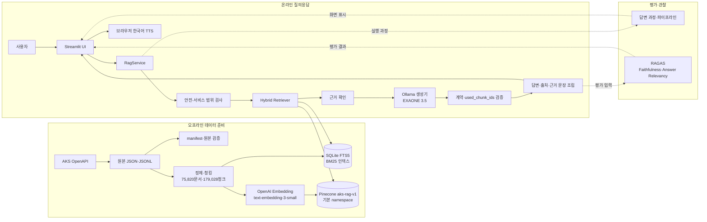
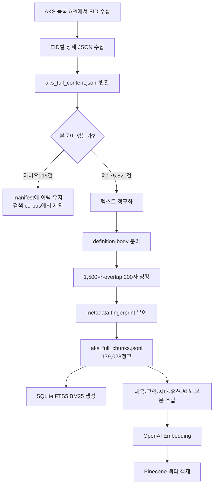
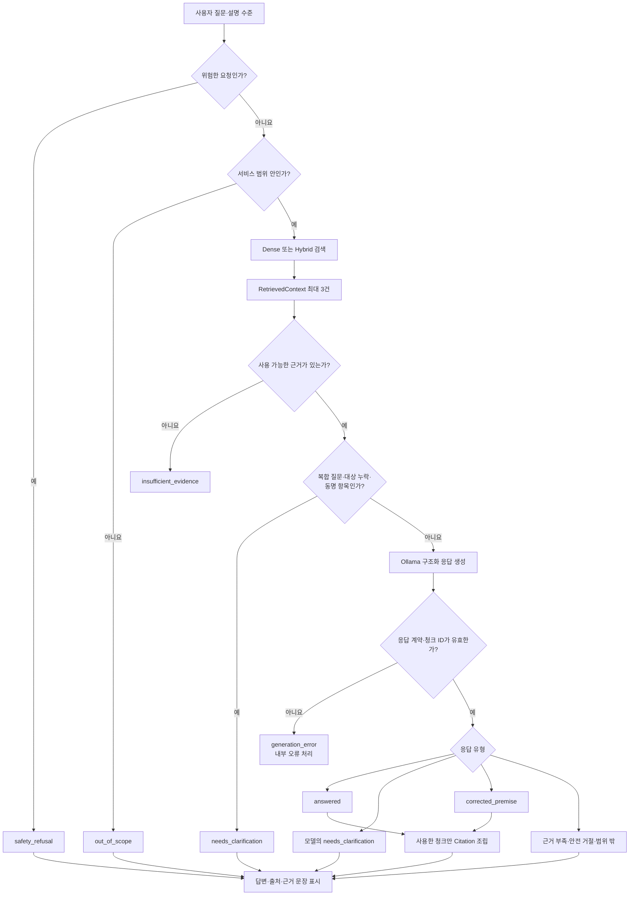

# 시스템 아키텍처

> 문서 기준일: 2026-09-03
>
> 적용 대상: SKN 33기 3차 프로젝트 `개인 맞춤형 AI 문화유산 가이드`
>
> 기준 코드: `main` commit `f38ac05`

## 1. 설계 목표

한국민족문화대백과사전의 한국 역사·문화 자료를 검색하고, 찾은 원문 근거 안에서 사용자의 이해 수준에 맞는 답변을 제공한다.

- 의미가 비슷한 문서를 찾는 Dense 검색과 정확한 제목·별칭을 찾는 BM25 검색을 함께 사용한다.
- 검색 점수만으로 답변 가능 여부를 단정하지 않고, 실제 근거 내용도 확인한다.
- LLM이 사용했다고 반환한 청크만 검증하여 출처와 근거 문장으로 표시한다.
- 검색·근거 판단·생성·화면을 분리해 구성 요소를 교체하거나 오류 위치를 찾기 쉽게 한다.
- 외부 연결이 준비되지 않은 환경에서는 Mock 화면을 제공하고 실제 응답으로 오해되지 않게 표시한다.

## 2. 전체 시스템 구성

제출용 한 장 요약본은 다음 이미지로 관리한다.





위 구성에서 `app/heritage_graph.py`는 문화유산 네트워크의 연관 항목을 만드는 모듈이다. 이름에 `graph`가 있지만 LangGraph 실행 흐름은 아니다.

## 3. 배치 위치와 외부 연결

| 위치 | 주요 구성 요소 | 역할 |
| :--- | :--- | :--- |
| 사용자 PC | Streamlit, `RagService`, BM25 SQLite | 화면, 요청 흐름 제어, 단어 검색 |
| OpenAI API | `text-embedding-3-small` | 질문을 1,536차원 벡터로 변환 |
| Pinecone | `aks-rag-v1` / `__default__` | 179,028개 v1 청크의 의미 검색 |
| RunPod | Ollama HTTP Service, EXAONE 3.5 | 검색 근거를 바탕으로 한국어 답변 생성 |
| OpenAI API·RAGAS | 평가 전용 Judge·Embedding | 답변 충실도와 질문 관련성 평가 |
| 브라우저 | Web Speech API | 화면 답변을 한국어 음성으로 읽기 |

Pinecone과 OpenAI Embedding은 Dense 검색에 필요하다. BM25 파일이 있으면 Hybrid 검색을 사용하고, 파일이 없으면 서비스가 중단되지 않도록 Dense 단독 검색으로 전환한다. RAGAS 평가는 답변 생성과 분리되어 있어 평가 호출에 실패해도 이미 생성된 답변은 유지한다.

## 4. 오프라인 데이터·인덱싱 흐름



현재 서비스 Pinecone DB는 v1 청크를 사용하며, 최신 v2 청킹 코드는 청킹 설정 fingerprint를 추가한다. v1과 v2 벡터는 같은 namespace에 섞지 않는다. 3차 프로젝트 제출에서는 기존 v1 DB를 재적재하지 않는다.

## 5. 사용자 질문 처리 흐름



### 5.1 검색

1. 질문을 `text-embedding-3-small`로 벡터화한다.
2. Pinecone에서 의미가 비슷한 후보 10개를 찾는다.
3. BM25에서 제목·별칭·본문의 단어가 일치하는 후보 10개를 찾는다.
4. 서로 단위가 다른 cosine과 BM25 점수를 직접 더하지 않고, 순위를 합치는 RRF를 사용한다.
5. Dense `1.5`, BM25 `1.0` 가중치로 순위를 합친다.
6. 같은 문서의 청크는 최대 2개로 제한하면서 최종 3개를 채운다.

BM25 파일이 없으면 2~6번의 Hybrid 결합 대신 Pinecone Dense 상위 3개를 사용한다. Hybrid의 RRF 점수에는 `0.40` 같은 cosine 기준선을 적용하지 않는다.

### 5.2 근거 확인과 생성

- 기본 `RAG_MIN_RETRIEVAL_SCORE`는 비워 두어 임의 점수로 청크를 제거하지 않는다.
- 현재 `ContentEvidenceChecker`는 내용이 비어 있는지와 생성기의 근거 부족 판단을 연결하는 임시 구현이다.
- 복합 질문, `그 궁궐` 같은 대상 누락 표현과 검색 결과의 동명 항목은 확정 가능한 규칙으로 먼저 확인한다. 규칙 밖의 모든 모호한 표현까지 보장하는 범용 판정기는 아니다.
- 생성기는 질문, 설명 수준과 검색 문맥을 받고 JSON Schema에 맞는 결과를 반환한다. 긴 청크 ID 대신 `CTX-1` 같은 짧은 참조를 사용한다.
- 반환된 참조는 실제 청크 ID로 복원한다. 한 청크만 가리키는 잘린 ID도 안전하게 복원하고, 근거를 확인할 수 없는 정상 답변은 `insufficient_evidence`로 낮춘다.
- 정규화 뒤에도 응답 계약이나 ID가 유효하지 않으면 Citation을 만들지 않고 `generation_error`로 처리한다.
- 보류·확인·거절 응답에는 `used_chunk_ids`를 붙이지 않는다.
- Citation은 LLM이 새로 작성하지 않는다. 같은 요청에서 보관한 `RetrievedContext`의 제목·URL·본문을 복사해 조립한다.

## 6. 생성과 개인화

| 항목 | 현재 기준 |
| :--- | :--- |
| 생성 서버 | RunPod의 Ollama HTTP Service |
| 생성 모델 | `exaone3.5:7.8b-instruct-q8_0` |
| Prompt 버전 | `response-type-v1-ollama` (`prompt-baseline-v0` 기반) |
| Temperature | `0.0` |
| Thinking 출력 | 사용하지 않음 (`think=false`) |
| 설명 수준 | `easy`, `general`, `advanced` |
| 최대 생성량 | 수준별 `384`, `640`, `1,024` tokens |
| 모델 유지 | 기본 `keep_alive=1h` |
| 출력 형식 | JSON Schema 기반 구조화 응답 |

설명 수준을 바꿔 다시 요청할 때는 같은 질문의 기존 검색 문맥을 재사용한다. 따라서 검색 결과가 달라져 생기는 영향을 줄이고 설명 방식의 차이를 비교할 수 있다.

## 7. 응답 계약과 화면 연결

| 계층 | 주요 출력 | 다음 계층에서 하는 일 |
| :--- | :--- | :--- |
| Retriever | `RetrievedContext[]` | 근거 확인과 생성 문맥으로 사용 |
| Generator | 응답 유형, `draft_message`, `used_chunk_ids` | 서비스가 형식과 ID를 검증 |
| `RagService` | `ServiceResponse`, 실행 추적 | Citation과 검색 과정을 UI에 전달 |
| Streamlit | 답변·출처·근거·평가 화면 | 사용자에게 표시하고 TTS 제공 |

화면은 `source_url`을 원문 링크로 사용하고 출처 표시명은 `한국민족문화대백과사전`으로 통일한다. 같은 문서에서 여러 청크가 사용된 경우 화면에서는 `document_id`로 묶어 제목을 한 번만 표시하되, 근거 문장은 모두 확인할 수 있다.

## 8. 화면 구성

| 탭 | 사용자에게 보여 주는 내용 |
| :--- | :--- |
| 질문하기 | 질문 입력, 설명 수준 선택, 답변, 출처와 근거 문장 |
| 답변 과정 | 현재 질문이 검색·생성·출처 조립을 거친 과정 |
| 파이프라인 | 실제 검색 방식, 검색 후보와 사용한 청크의 변화 |
| 평가 결과 | RAGAS Faithfulness·Answer Relevancy와 평가 상태 |
| 문화유산 네트워크 | 선택 항목과 시대·분야·지역 등이 연결된 연관 항목 |

환경 변수가 준비되지 않으면 화면은 Mock 모드로 실행한다. Mock 응답은 화면 확인용이며 실제 검색·생성 결과와 구분해 표시한다.

## 9. 오류·보안 처리

| 상황 | 처리 방식 |
| :--- | :--- |
| 비밀정보·Prompt injection 요청 | 검색 전에 `safety_refusal`로 종료 |
| 실시간 정보 등 서비스 범위 밖 질문 | 검색 전에 `out_of_scope`로 종료 |
| 검색 결과 없음·근거 부족 | 추측하지 않고 `insufficient_evidence` 반환 |
| 여러 질문을 한 번에 입력 | `needs_clarification`으로 한 질문씩 요청 |
| 잘린 근거 ID | 한 청크만 가리키는 경우 실제 `chunk_id`로 복원 |
| 근거를 확인할 수 없는 정상 답변 | `insufficient_evidence`로 낮추고 Citation을 만들지 않음 |
| 정규화 후에도 잘못된 계약·ID | Citation을 만들지 않고 내부 `generation_error` 처리 |
| 외부 서비스 오류 | 내부 원문을 화면에 노출하지 않고 사용자용 안내 표시 |
| API 키 | `.env`에서만 읽고 Git·로그·화면에 값을 출력하지 않음 |

## 10. LangChain·LangGraph 적용 범위

### LangChain

관련 패키지와 평가 연동 의존성은 설치되어 있지만, 현재 핵심 실행 흐름은 프로젝트 내부의 `RagService`와 명시적인 Python 컴포넌트 조립으로 구성한다. 문서에서는 사용하지 않은 LangChain Chain이나 LangSmith Trace가 실제 동작하는 것처럼 표시하지 않는다.

### LangGraph

LangGraph를 이용한 분기·재검색 구조를 별도로 실험했으나 3차 프로젝트 최종 실행 경로에는 포함하지 않는다.

- 초기 LangGraph 방식은 기존 방식보다 응답 유형·보류 판단 성능이 낮고 재검색이 늘었다.
- 이유 기반 분기로 개선한 실험에서는 일부 정확도와 Citation recall이 높아졌다.
- 대신 평균 응답시간이 늘었고, 발표 전 기존 서비스에 안전하게 통합·회귀 검증할 시간이 부족했다.
- 따라서 3차 프로젝트에서는 검증된 `RagService` 경로를 사용하고, 개선 LangGraph는 후속 적용 후보로 남긴다.

## 11. 현재 한계와 후속 확장

| 현재 한계 | 영향 | 후속 방향 |
| :--- | :--- | :--- |
| 의미 기반 EvidenceChecker가 임시 구현 | 근거 충분성 판단이 생성기 판단에 의존 | 별도 의미 판정기 또는 reranker 비교 |
| BM25 DB는 로컬 생성 파일 | 파일이 없는 환경에서는 Dense 단독으로 동작 | 제출물에 생성 절차·체크섬 포함 |
| 복합 질문은 분리 답변하지 않음 | 여러 질문을 한 번에 처리하지 못함 | 질문 분해 → 질문별 검색 → 근거별 응답 검토 |
| 오타 후보 제안 계층 미연결 | 정확한 표제어 오타에서 다른 문서가 검색될 수 있음 | BM25 제목·별칭 exact index 기반 후보 조회 |
| LangGraph 개선안 미통합 | 정교한 재검색·분기 이점을 최종 서비스에 적용하지 못함 | 동일 평가셋으로 속도·정확도 재검증 후 적용 |
| OpenAI·Pinecone·RunPod 의존 | 네트워크·요금·키 상태에 따라 실제 모드 제한 | 상태 점검, 제한된 재시도, 로컬 대체안 검토 |

## 12. 실행 경로

```text
python run.py
  → streamlit run app/app.py
  → app/retrieval.py
  → app/rag_client.py
  → src/rag_service/service.py
  → Dense/Hybrid Retriever
  → OllamaGenerator
  → ServiceResponse·Citation
  → Streamlit 화면
```

필수 환경 변수와 실행 준비 절차는 프로젝트 `README.md`와 `.env.example`에서 관리한다.

## 13. 주요 구현 파일

| 영역 | 파일 |
| :--- | :--- |
| Streamlit 진입점 | `app/app.py` |
| 화면–서비스 연결 | `app/retrieval.py`, `app/rag_client.py` |
| RAG 요청 흐름·계약 검증 | `src/rag_service/service.py` |
| 근거 정책 | `src/rag_service/grounding.py` |
| Ollama 생성 | `src/rag_service/ollama_generator.py` |
| Pinecone 검색·Adapter | `src/rag_indexing/pinecone_store.py` |
| BM25 검색 | `src/rag_indexing/bm25_store.py` |
| RRF Hybrid 검색 | `src/rag_indexing/hybrid_retriever.py` |
| 답변 품질 평가 | `src/evaluation/ragas_evaluator.py` |
| 브라우저 TTS | `app/components/response_cards.py` |
