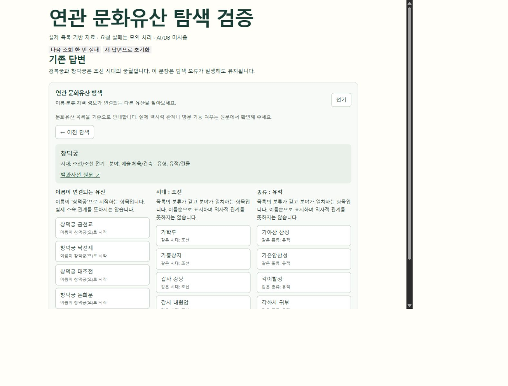
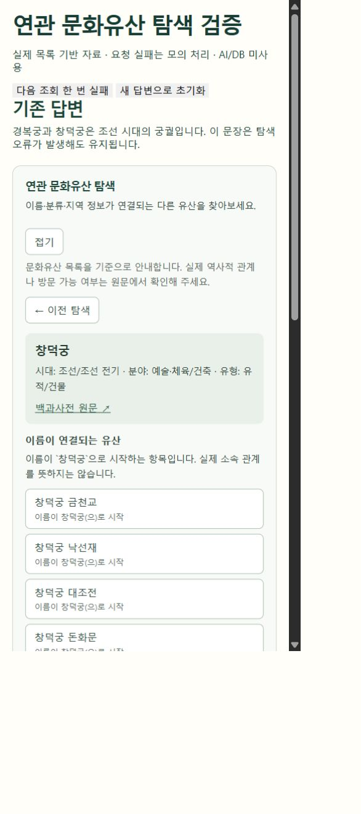

# 문화유산 연관 탐색 — #17 후속 구현

## 목적과 범위

#17의 데이터 처리와 API 연결 구조를 이어받아, 현재 React 답변 아래에 독립된 탐색 영역을 추가했습니다. 최신 main `28663b6`(#24 병합)을 기준으로 작업했습니다. 원본 구현: [#17](https://github.com/SpicyAutumn/SKN33-4th-1Team/pull/17), 작성자 `suhoo898`, 커밋 `c48494d`, `caa9fa4`, `fe812be`, `e48a74e`.

| 기존 구현에서 이어받은 부분 | 이번에 달라진 부분 |
|---|---|
| 문화유산 목록 읽기, 이름·분류·지역을 이용한 후보 구성 | 다른 분야만 남는 경우 이름 연결을 생략하고, 연결 근거를 실제 역사적 관계와 구분 |
| 질문에서 중심 대상 찾기 | 복수 대상·동명 문서는 후보를 반환해 사용자가 선택 |
| Django에서 네트워크 제공, Docker에 목록 포함 | 기본 API는 외부 AI·벡터 검색을 호출하지 않고 목록만 사용 |
| 항목 이동과 이전 탐색 | 성공 후에만 기록 변경, 실패한 대상 재시도, 늦은 응답 무시 |
| 네트워크 탐색 화면 | 현재 답변·사진·출처·제보·게시판을 유지하고 별도 컴포넌트/CSS로 추가 |

이번 범위에는 방사형 도식, Pinecone 유사도 추천, 설명문 추가 조회가 포함되지 않습니다. 목록 기반 후보는 분야가 같은 항목 중 이름순으로 제시하며, 같은 시대·유형이라는 사실만으로 역사적 관계를 주장하지 않습니다. 개념의 대표 시대·유형은 이름과 분야가 연결되는 항목에서 추린 값입니다. 지역은 이름에서 추정하므로 현재 위치나 관람 가능 여부를 보장하지 않습니다.

## API

`GET /api/v1/heritage-network`

| 입력 | 동작 |
|---|---|
| `question`(최대 500자), 선택적으로 `document_ids`(쉼표 구분, 최대 10개) | 질문의 표제어 후보를 우선하고, 없을 때 출처 문서 후보 사용 |
| `document_id` | 사용자가 선택한 문서에서 탐색 시작. 질문·후보 ID 입력과 동시에 사용하지 않음 |

문서 ID는 `aks:` 뒤 영문·숫자·밑줄·하이픈 1~64자입니다. 로그인과 DB 쓰기가 필요하지 않은 읽기 전용 API입니다.

- 200: `mode: catalog`, `root`, `branches`. 연결이 없으면 `branches: []`.
- 200(복수 후보): `requires_selection: true`, `candidate_count`, `candidates`. 최대 20개를 표시하고 초과 시 질문 구체화 안내.
- 422: 입력 없음, 형식 오류, 길이/개수 초과, 서로 다른 조회 방식 혼용.
- 404: 찾을 수 없는 대상.
- 503: 목록/모듈 준비 실패. 내부 오류 내용은 응답에 포함하지 않음.
- 405: GET 이외 요청.

## 검증 결과

| 확인 항목 | 결과 |
|---|---|
| 목록 처리 회귀 테스트 | 6개 통과. 복수 대상, 긴 이름 내부의 짧은 표제어, 동명 항목, 분야 필터, 알 수 없는 시대, 실제 목록 탐색 |
| Django API 테스트 | 6개 통과. 입력 검증, GET 제한, 오류 응답, 실제 목록의 단일/복수 대상, 없는 ID, 목록 누락 |
| 프론트 탐색 상태 테스트 | 5개 통과. 실패한 대상 재시도, 이전 기록 보존, 늦은 응답 무시, 화면 종료, 후보 선택 복귀 |
| 기존 제보/사진 검사와 프론트 빌드 | 통과 |
| 브라우저 직접 조작 | 후보 선택, 조회 실패 후 동일 대상 재시도, 이전 이동 실패 후 재시도하여 후보 화면 복귀 확인 |
| 좁은 화면 | 표시 영역 너비 469px에서 문서 가로 넘침 없음. 넓은 화면에서도 목록 표시 확인 |
| 브라우저 오류 | 검증 탭의 콘솔 경고·오류 없음 |

브라우저 검증은 실제 목록에서 만든 고정 자료와 모의 실패 요청을 사용했습니다. 실제 AI 답변 생성부터 API까지의 전체 연결 확인은 포함하지 않습니다. 기존 전체 Python 테스트는 로컬 환경의 `python-dotenv` 등 의존성 부족으로 실행을 완료하지 못했으며, 저장소의 Python CI에서 확인합니다.

재현 명령(저장소 루트):

```sh
python -m unittest discover -s tests -p test_heritage_network.py
PYTHONPATH=backend python -m unittest discover -s backend/network_tests -p 'test_*.py'
cd frontend
npm ci
node --test tests/heritageNetwork.test.js
node scripts/check-report.mjs
node scripts/check-answer-media.cjs
npm run build
npm run dev
```

API 테스트에는 `Django==5.2.17`이 필요합니다. `/network-review.html`은 개발 서버 전용 검증 화면이며 제품 빌드 진입점에 포함하지 않습니다. 검증 자료는 AI/DB를 사용하지 않습니다.





## 병합 전 순서

1. #18과 #23의 최종 반영 내용을 기준으로 최신 main을 다시 가져옵니다.
2. `App.jsx`의 출처 영역 다음에 탐색 영역을 유지하면서 정정·요약·사진·출처·제보·게시판 흐름을 함께 확인합니다. 기존 답변 영역을 이전 버전으로 바꾸지 않습니다.
3. 최신 조합에서 자동 검사와 실제 API/화면 연결을 확인합니다. 기본 탐색은 RunPod가 없어도 가능하며, 실제 생성 답변에서 탐색으로 이어지는 시연은 AI 환경 연결 후 별도로 확인합니다.
4. 결과를 PR에 갱신한 뒤 Draft를 해제하고 팀원 승인을 받아 병합합니다.

#24는 기반 main에 포함되어 있습니다. #23의 공통 스타일과 충돌 범위를 줄이기 위해 `styles.css`를 수정하지 않았습니다. #26의 README 변경은 이 기능의 선행 병합 조건이 아닙니다.
