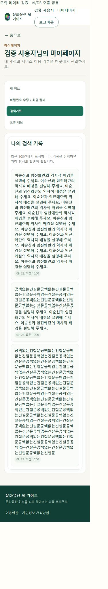

# PR #40 · #41 통합 및 검색기록 레이아웃 보완

- #41의 마이페이지·기록 상세 URL과 #40의 인물 선택 유지 기능을 함께 보존해 App.jsx 충돌 4곳을 해소했습니다.
- 일반 기록 열기와 마이페이지 상세 기록 조회에서 이전 질문의 선택 정보를 초기화합니다.
- 마이페이지 메뉴 클릭 시 클릭 이벤트가 메뉴 이름으로 전달되던 부분을 명시적인 함수 호출로 바꿨습니다.
- 마이페이지 검색기록에만 폭 제한·긴 질문 줄바꿈·날짜 별도 행을 적용했습니다. 모바일의 내부 여백도 줄였습니다.

## 확인 결과

- 프런트엔드 자동 검사 34건 및 제품 빌드 통과.
- 모의 데이터 브라우저 검증: 긴 문장 및 공백 없는 긴 질문 목록에서 문서 폭/스크롤 폭 각각 데스크톱 1265/1265px, 모바일 375/375px 확인.
- 마이페이지 메뉴 → 검색기록 → 상세 → 브라우저 뒤로가기 목록 복귀 확인.
- 인물 선택 → 재검색 → 성인 일반 수준 변경 시 interaction_id, selected_source_chunk_ids, clarification_context 유지 확인.
- 외부 AI 호출·회원정보 변경·DB 쓰기 없음. 추천 API는 이 로컬 검증 화면에 연결하지 않았으며 추천 품질 검증은 포함하지 않습니다.

재현 화면: 개발 서버의 `/mypage-review.html`. 요청·사용자·검색기록은 모의 데이터입니다.

저장된 과거 기록에 선택 정보가 없을 때 이를 복원하는 기능은 추가하지 않았습니다. 이전 화면의 선택 정보를 잘못 재사용하지 않도록 초기화합니다.
