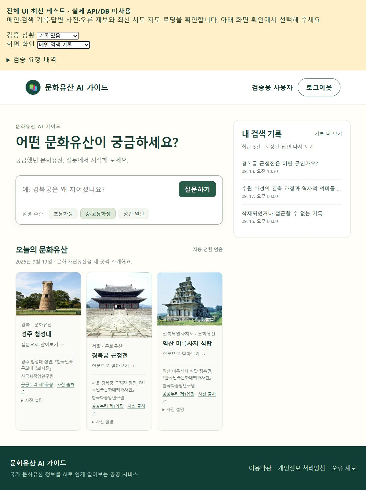
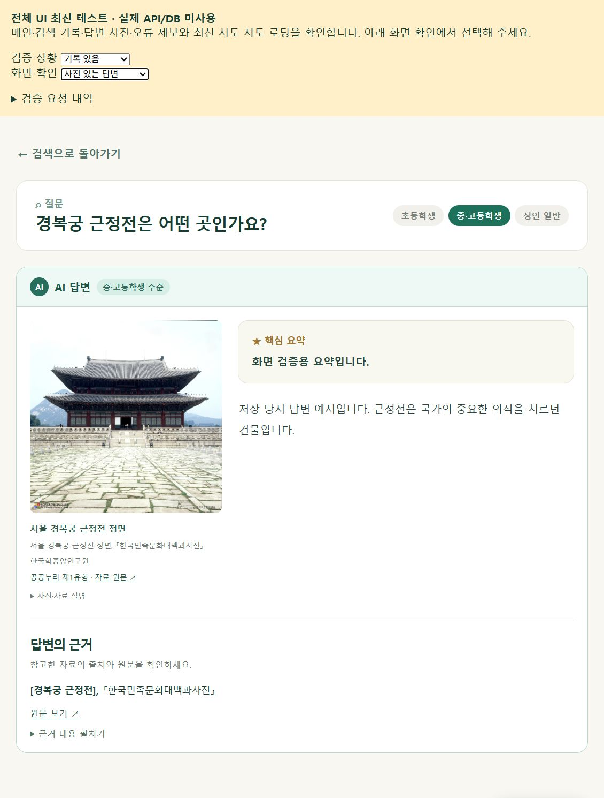
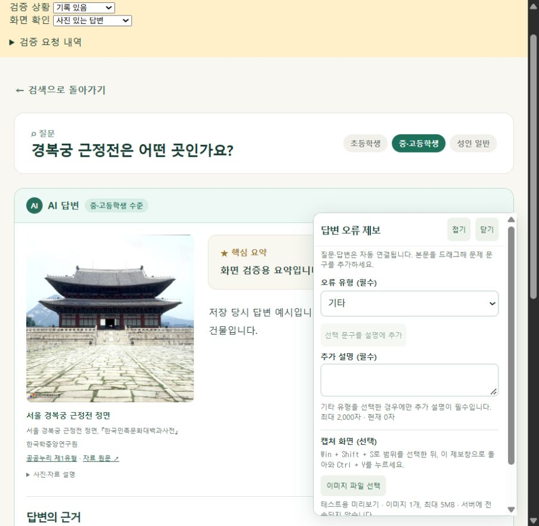
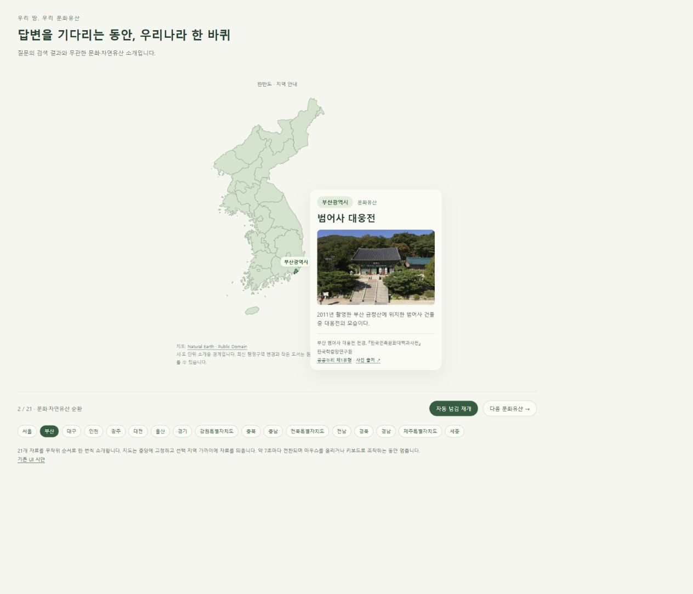

# PR #23 화면 미리보기

2026-09-19 테스트 페이지를 브라우저에서 실행하여 캡처했습니다. 계정·검색 기록·답변은 검증용 예시이며, 실제 AI 응답이나 서버 저장을 검증한 자료는 아닙니다. 노란 상단 영역은 테스트 화면 선택 도구입니다.

## 1. 메인 화면

오늘의 문화유산 사진과 출처, 내 검색 기록 배치를 확인합니다.



## 2. 사진과 답변, 하단 근거

사진 출처와 답변 근거를 각각 확인할 수 있습니다.



## 3. 오류 제보

답변을 보면서 제보할 수 있는 패널입니다. 이 캡처의 6가지 유형·기타만 설명 필수·이미지 붙여넣기는 **검토 전용 제안**입니다. 운영 계약 반영과 첨부 서버 저장은 별도 협의가 필요합니다.



## 4. 지도 로딩

지도는 고정되고 시·도 영역과 문화유산 카드가 함께 전환됩니다. 캡처는 정지 화면이며, 아래 절차로 실제 전환을 확인할 수 있습니다. 현재 새 지도는 테스트 화면에만 연결되어 있습니다.



## 병합 없이 직접 실행하기

PR의 `codex/ui-media-integration-check` 브랜치를 별도 작업 폴더에 준비한 후, 해당 폴더의 `frontend`에서 실행합니다.

```powershell
npm ci
npm run dev -- --host 127.0.0.1 --port 5175
```

1. `http://127.0.0.1:5175/history-review.html`에서 **화면 확인**을 메인·검색 기록 → 답변 준비 중 → 사진 있는 답변 순서로 변경합니다.
2. 사진 있는 답변에서 **답변 오류 제보**를 누르고 **기타**를 선택하면 추가 설명이 필수로 표시됩니다. 캡처는 Win + Shift + S로 선택 후 패널에서 Ctrl + V로 붙여넣어 미리볼 수 있습니다. 서버 전송은 하지 않습니다.
3. `http://127.0.0.1:5175/center-map-review.html`에서 약 7초 간격의 지역 전환을 봅니다. 지도 위에 마우스를 올리거나 키보드로 조작하면 자동 전환이 멈춥니다.
4. `http://127.0.0.1:5175/loading-demo.html`에서는 약 16초 로딩 후 예시 답변 자리로 바뀌는 흐름을 확인합니다.

이 테스트 페이지에는 RunPod·DB 연결이 필요하지 않습니다. localhost 주소는 실행한 본인의 PC에서만 열립니다. 사진·지도 출처는 각 화면에 표시되어 있습니다.
