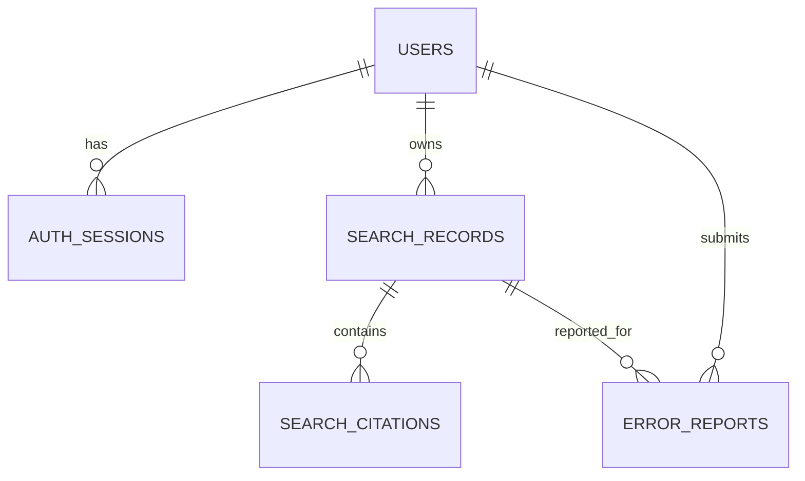

# 4차 프로젝트 DB 스키마 v1 초안

> 범위: 회원, 인증 세션, 개인 검색 기록, 답변 출처 스냅샷, 비공개 오류 제보
>
> 현재 구현 기준: Django ORM + MySQL, `backend/api/migrations/0004_service_v1_mysql.py`
>
> 참고 설계안: `db/schema_v1.sql` (PostgreSQL 문법이며 현재 서비스에 직접 적용하지 않음)

## 0. 문서 상태

| 구분 | 상태 |
| :--- | :--- |
| Django 모델·migration에 존재하는 테이블과 필드 | 현재 구현 |
| PostgreSQL 전용 타입·체크 제약·부분 인덱스·복합 외래키 | 참고용 초안 |
| 검색 기록의 `summary` 저장 | 추가 논의 필요(#15의 문장 처리 규칙과 함께 결정) |
| DB 수준의 검색 기록·제보 소유자 일치 강제 | 향후 계획(현재는 API에서 검사) |

## 1. 저장 원칙

- 관계형 서비스 DB와 검색 인덱스를 분리한다.
- 관계형 DBMS는 회원·권한·검색 이력·제보처럼 트랜잭션과 소유권 검사가 필요한 데이터를 저장한다. 현재 서비스 DBMS는 MySQL이며 Django migration이 실제 스키마 기준이다.
- Pinecone은 Dense 검색용 벡터·청크 metadata, 로컬 SQLite FTS5는 BM25 검색 인덱스다. 둘은 서비스 회원 DB의 테이블이 아니다.
- 검색 기록은 답변 당시의 결과를 스냅샷으로 보존한다. 이후 RAG 인덱스가 바뀌어도 오류 제보가 가리킨 답변을 확인할 수 있어야 한다.
- 원시 비밀번호·세션 토큰, 내부 프롬프트, 전체 모델 원시 출력, API 키는 저장하지 않는다.
- 모든 개인 목록과 상세 조회는 `owner_user_id = current_user.id` 조건을 서버 쿼리에 포함한다.

## 2. 관계



## 3. 테이블

### 3.1 `users`

| 열 | 형식 | 규칙 |
| :--- | :--- | :--- |
| `id` | UUID | PK |
| `email` | varchar(254) | 소문자 정규화, unique |
| `password_hash` | text | 원문 저장 금지 |
| `name` | varchar(50) | 표시 이름 |
| `role` | varchar(20) | `member`, `staff`, `admin` |
| `is_active` | boolean | 기본 true |
| `created_at`, `updated_at` | timestamptz | UTC |

소셜 로그인은 MVP 범위가 아니므로 공급자 테이블을 만들지 않는다. 도입 시 `user_id`, `provider`, `provider_subject`를 갖는 별도 테이블로 추가한다.

### 3.2 `auth_sessions`

| 열 | 형식 | 규칙 |
| :--- | :--- | :--- |
| `id` | UUID | PK, 쿠키에 넣는 값과 별개 |
| `user_id` | UUID | FK → users |
| `token_hash` | char(64) | 세션 토큰 SHA-256 해시, unique |
| `expires_at` | timestamptz | 만료 시각 |
| `last_seen_at` | timestamptz | 선택적 활동 갱신 |
| `revoked_at` | timestamptz nullable | 로그아웃·강제 폐기 |
| `created_at` | timestamptz | 생성 시각 |

회원 삭제 정책이 확정되기 전에는 실제 행 삭제보다 `is_active=false`와 세션 폐기를 사용한다.

### 3.3 `search_records`

| 열 | 형식 | 규칙 |
| :--- | :--- | :--- |
| `id` | UUID | API의 `search_record_id` |
| `owner_user_id` | UUID | FK → users |
| `rag_request_id` | varchar(80) | 기존 RAG `request_id`, unique |
| `interaction_id` | varchar(80) | 이어서 질문 묶음 |
| `schema_version` | varchar(30) | 예: `0.3.0-draft` |
| `question` | text | 질문 스냅샷 |
| `audience_level` | varchar(20) | `easy`, `general`, `advanced` |
| `response_type` | varchar(40) | 기존 여섯 의미 유형 |
| `message` | text | 최종 답변 스냅샷 |
| `clarification`, `premise_correction` | jsonb nullable | 기존 계약의 구조화 필드 |
| `warnings` | jsonb | 문자열 배열 |
| `created_at` | timestamptz | 검색 시각 |

`related_topics`는 현재 RAG 설정에서 비활성이고 회의 MVP도 아니므로 v1 DB에 별도 저장하지 않는다. 기능이 활성화되면 계약 버전과 함께 추가한다.

새 검색 응답의 `summary`도 현재 별도 저장하지 않는다. 따라서 검색 기록 상세에서는 `message`와 출처 스냅샷만 재현한다. `summary` 열 추가 여부는 #15의 요약 규칙 확정 뒤 migration과 함께 결정한다.

### 3.4 `search_citations`

검색 당시 사용자에게 제공한 출처만 순서대로 저장한다.

| 열 | 형식 | 규칙 |
| :--- | :--- | :--- |
| `id` | UUID | PK |
| `search_record_id` | UUID | FK → search_records |
| `ordinal` | smallint | 응답 내 출처 순서, 1부터 |
| `chunk_id`, `document_id` | text | RAG 식별자 스냅샷 |
| `title` | text | 출처 제목 |
| `source_url`, `section` | text nullable | 원문 위치 |
| `retrieval_rank` | integer | 검색 순위 |
| `content` | text | 응답 시 표시한 근거 원문 스냅샷 |

동일 검색 기록 안에서 `ordinal`과 `chunk_id`는 각각 중복될 수 없다.

### 3.5 `error_reports`

| 열 | 형식 | 규칙 |
| :--- | :--- | :--- |
| `id` | UUID | PK |
| `owner_user_id` | UUID | FK → users |
| `search_record_id` | UUID | FK → search_records |
| `category` | varchar(40) | 합의된 제보 유형 |
| `content` | text | 10~2000자 |
| `status` | varchar(20) | 기본 `received` |
| `staff_reply` | text nullable | 담당자 기능 확정 전에는 null |
| `handled_by_user_id` | UUID nullable | staff/admin 사용자 |
| `handled_at` | timestamptz nullable | 처리 시각 |
| `created_at`, `updated_at` | timestamptz | 생성·수정 시각 |

PostgreSQL 참고 DDL은 `(search_record_id, owner_user_id)` 복합 외래키로 검색 기록과 제보의 소유자 일치를 보장하는 안을 담고 있다. 현재 Django·MySQL migration에는 이 복합 외래키가 없으며, API가 제보 생성·조회 시 `owner=current_user` 조건으로 검사한다. DB 수준 보장은 향후 migration에서 검토한다.

## 4. 조회와 권한 패턴

```sql
-- 내 검색 기록 상세. 타인의 ID는 결과가 0행이므로 API에서 404 처리한다.
SELECT *
FROM search_records
WHERE id = :record_id
  AND owner_user_id = :current_user_id;

-- 내 제보 상세도 같은 방식으로 소유권을 쿼리에 포함한다.
SELECT *
FROM error_reports
WHERE id = :report_id
  AND owner_user_id = :current_user_id;
```

현재 Django migration의 목록 인덱스는 `(owner_id, created_at)`이다. `(owner_user_id, created_at DESC, id DESC)` 인덱스와 서명된 커서는 페이지네이션을 구현할 때 함께 검토한다.

## 5. 트랜잭션 경계

- 검색 성공 후 `search_records`와 `search_citations`를 하나의 트랜잭션으로 저장한다.
- RAG가 실패하면 검색 기록을 생성하지 않는다. 운영 지표가 필요하면 개인정보를 최소화한 별도 관측 로그를 사용한다.
- 오류 제보 생성 시 검색 기록의 소유권 확인과 `error_reports` INSERT를 한 트랜잭션에서 처리한다.
- 로그아웃 시 현재 `auth_sessions.revoked_at`을 갱신한다.

## 6. 보관과 삭제

검색 기록 삭제와 보관 기간은 회의에서 미정이다. v1은 삭제 API를 제공하지 않으며, 팀이 기간을 확정할 때 다음을 함께 결정한다.

1. 회원 탈퇴 시 검색 기록·제보를 삭제할지 익명화할지
2. 처리 중인 제보가 연결된 검색 기록의 삭제 제한
3. 세션·운영 로그의 자동 만료 기간
4. 개인정보 처리방침에 표시할 보관 목적과 기간

스키마 변경은 새 migration으로만 수행하고 이미 적용한 migration 파일을 수정하지 않는다.
