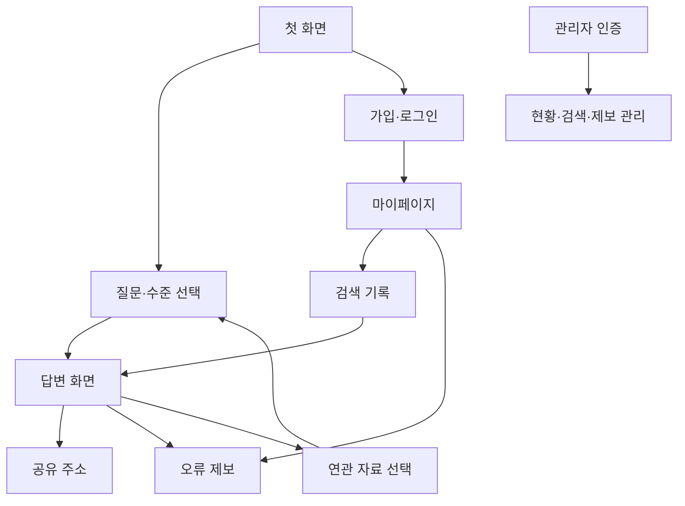

# 화면 설계서

## 1. 화면 목록

| ID | 화면 | 주요 내용 | 주요 상태 | 요구사항 |
|---|---|---|---|---|
| UI-01 | 첫 화면 | 질문, 설명 수준, 이용 진입 | 기본·입력 오류 | FR-01 |
| UI-02 | 답변 | 요약·본문·정정, 출처·사진, 공유·연관 탐색 | 생성 중·성공·보류·실패 | FR-02·03·06·09·10 |
| UI-03 | 회원가입·로그인 | 이름·이메일·비밀번호, 오류 안내 | 입력·인증 실패·완료 | FR-04 |
| UI-04 | 마이페이지 | 내 정보, 보안 설정, 검색 기록, 제보 내역 | 목록 없음·상세·변경·탈퇴 확인 | FR-04·05·07 |
| UI-05 | 제보 입력·상세 | 답변 연결, 유형·내용, 처리 상태·답변 | 등록·유효성 오류·처리 결과 | FR-07 |
| UI-06 | 관리자 | 별도 인증, 현황·이용자·검색·제보 | 인증 필요·목록·상세·처리 | FR-08 |
| UI-07 | 공유 답변 | 공개된 질문·답변·근거·사진 | 정상·없는 링크 | FR-06 |

## 2. 화면 이동 흐름



## 3. 답변 화면 구성 참고

아래는 정보 배치를 설명하는 개념도이며, 최종 화면 캡처가 아니다.

```text
┌──────────────────────────────────────┐
│ 질문 · 선택한 설명 수준                │
├──────────────────────────────────────┤
│ 정정 또는 추가 확인 안내(해당 시)       │
│ 핵심 요약                 [공유하기]  │
│ 전체 설명                             │
├───────────────────┬──────────────────┤
│ 근거 원문·내용      │ 연결된 사진·출처  │
├───────────────────┴──────────────────┤
│ 함께 알아보기: 추천 항목·추천 이유      │
│ 수준 변경 · 추가 질문 · 오류 제보      │
└──────────────────────────────────────┘
```

## 4. 화면 작성·검증 기준

| 조건 | 표시 기준 |
|---|---|
| 답변 생성 중 | 진행 상태와 재시도 가능 여부를 알리고 완료 답변처럼 보이지 않게 함 |
| 근거 부족 | 답변할 수 있는 범위와 보류 이유를 구분 |
| 정정 | 질문의 잘못된 전제와 이후 설명의 구분 확인 |
| 사진·추천 없음 | 빈 영역이나 오류 대신 해당 자료 없음 안내 |
| 개인 결과 접근 실패 | 다른 사람의 기록 존재 여부를 과도하게 노출하지 않음 |
| 공유 | 공개 범위가 질문·답변을 포함함을 사용자가 이해할 수 있게 안내 |
| 과거 기록 | 저장하지 않았던 요약을 새로 생성한 것처럼 표시하지 않음 |
| 작은 화면 | 긴 제목·원문 URL·제보 입력에서 가로 넘침과 버튼 겹침 확인 |

공유 범위 안내 등 위 기준 중 실제 문구·동작은 최종 캡처와 함께 검증한다. 기준을 기재한 사실만으로 구현 완료로 판단하지 않는다.

## 5. 최종 캡처 목록

| 캡처 | 포함 내용 | 상태 |
|---|---|---|
| SC-01 | 첫 화면·세 설명 수준 | 최종 캡처 대기 |
| SC-02 | 정상 답변·근거·사진 | 최종 캡처 대기 |
| SC-03 | 정정 또는 보류·되묻기 | 최종 캡처 대기 |
| SC-04 | 기록 재열기·공개 공유 | 최종 캡처 대기 |
| SC-05 | 본인 제보·관리자 처리 | 최종 캡처 대기 |
| SC-06 | 모바일·자료 없음·실패 | 최종 캡처 대기 |

실제 사용자의 이름·이메일·질문을 촬영하지 않는다. 모의 응답을 사용했다면 캡처에 “모의 응답”임을 표시하고 실제 AI 시연과 구분한다.

근거: [App.jsx](https://github.com/SpicyAutumn/SKN33-4th-1Team/blob/7811a717e39a853a01c2bb860b6296b38ba48ea0/frontend/src/App.jsx), [화면 구성요소](https://github.com/SpicyAutumn/SKN33-4th-1Team/blob/7811a717e39a853a01c2bb860b6296b38ba48ea0/frontend/src/components), [공유 흐름](https://github.com/SpicyAutumn/SKN33-4th-1Team/blob/7811a717e39a853a01c2bb860b6296b38ba48ea0/docs/SEARCH_RESULT_LINKS.md).
