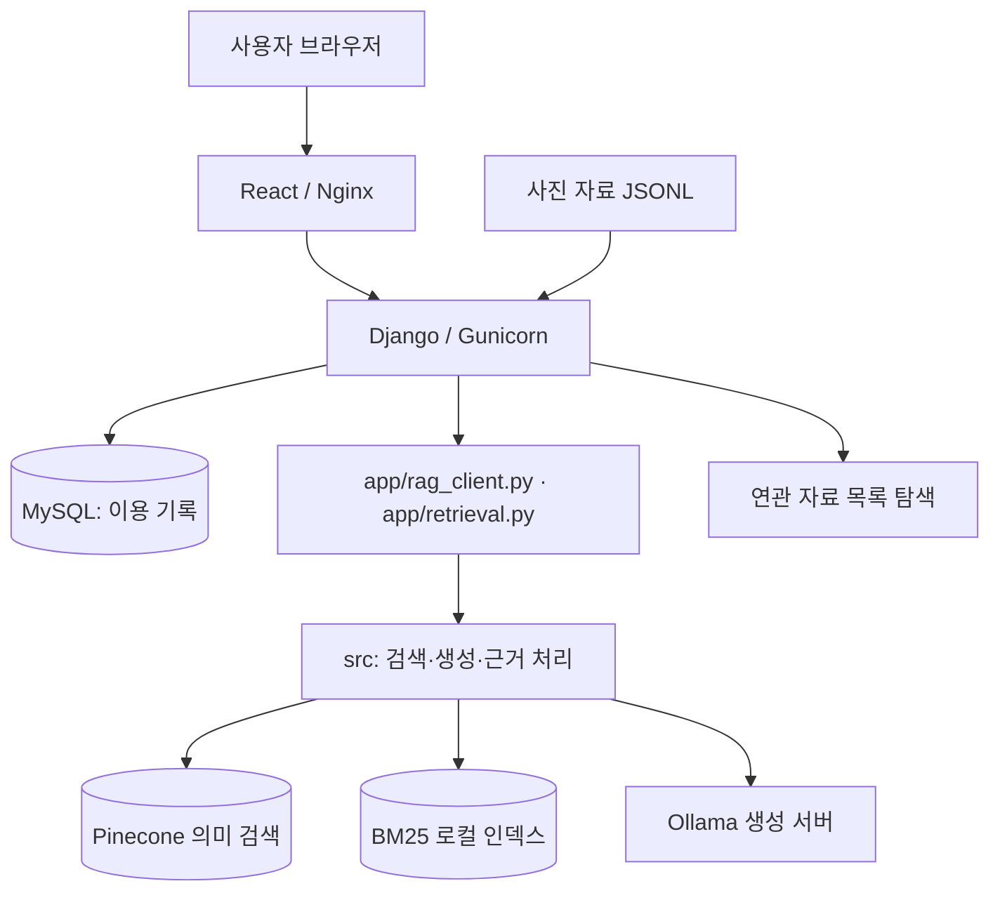
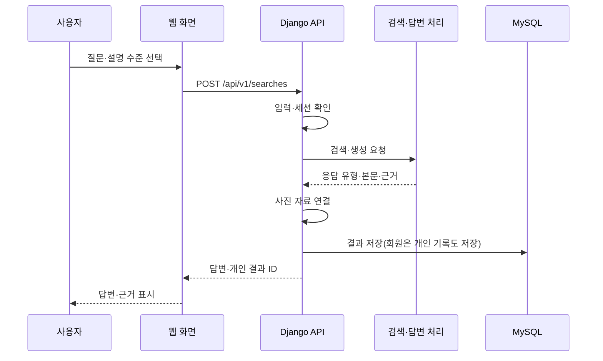
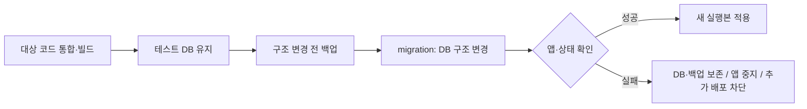

# 시스템 구성도

## 1. 전체 구성

## 2. 구성요소의 역할

| 요소 | 쉬운 설명 | 주요 위치 |
|---|---|---|
| React | 사용자가 보는 질문·답변·계정 화면 | frontend/ |
| Nginx | 웹 파일 제공 및 API 요청 전달 | frontend/, deploy/ |
| Django·Gunicorn | 요청 처리, 권한 확인, DB·AI 연결 | backend/ |
| 기존 RAG 연결 계층 | 웹 요청을 기존 검색·답변 코드로 전달 | app/, backend/api/rag_runtime.py |
| 검색·생성 핵심 코드 | 관련 자료를 찾고 답변과 근거를 구성 | src/ |
| MySQL | 회원·검색 기록·출처·제보·공유 결과 저장 | 외부 DB 또는 테스트용 별도 DB |
| Pinecone·BM25 | 의미가 가까운 자료와 단어가 맞는 자료 검색 | 외부 검색 서비스·로컬 인덱스 |
| Ollama | 설정한 언어모델로 답변 생성 | 별도 생성 서버 |

`app/`은 단순히 과거 Streamlit 화면만 보관하는 폴더가 아니다. 현재 웹 RAG가 사용하는 파일이 있으므로 최종 정리 시 의존성을 함께 확인한다.

## 3. 질문 처리 순서

실패 시 정상 응답과 다른 오류 경로를 사용한다. 상세 예외별 저장·롤백 동작은 통합 시험에서 확인한다.

## 4. 환경 구분

| 환경 | 구성·목적 | 확인 상태 |
|---|---|---|
| 로컬 | Compose의 웹 8081 포트, 외부 서비스 연결 | 설정 파일 확인 |
| 운영 | [skn33heritage.site](https://skn33heritage.site/) · AWS·HTTPS | 도메인 연결·사용 중; 기능별 시험 결과는 별도 관리 |
| 공용 테스트 | 별도 EC2·MySQL, main과 preview PR 조합 | #46 코드 반영; 현재 실행 상태 미확인 |

기본 Compose에는 MySQL 서비스가 포함되지 않는다. 테스트 전용 DB 컨테이너 구성과 운영 DB를 같은 구성으로 그리지 않는다.

## 5. 테스트 배포·데이터 보호

마이그레이션은 DB 구조를 순서대로 변경하는 작업이다. 실패 시 DB를 삭제하거나 이전 앱을 무조건 실행하지 않는다. 테스트 복제 데이터는 개인정보를 치환하며 운영 DB로 역복사하지 않는다.

근거: [Compose](https://github.com/SpicyAutumn/SKN33-4th-1Team/blob/7811a717e39a853a01c2bb860b6296b38ba48ea0/docker-compose.yml), [백엔드 이미지](https://github.com/SpicyAutumn/SKN33-4th-1Team/blob/7811a717e39a853a01c2bb860b6296b38ba48ea0/backend/Dockerfile), [RAG 연결](https://github.com/SpicyAutumn/SKN33-4th-1Team/blob/7811a717e39a853a01c2bb860b6296b38ba48ea0/backend/api/rag_runtime.py), [HTTPS](https://github.com/SpicyAutumn/SKN33-4th-1Team/blob/7811a717e39a853a01c2bb860b6296b38ba48ea0/docs/MAIN_HTTPS.md), [테스트 DB](https://github.com/SpicyAutumn/SKN33-4th-1Team/blob/7811a717e39a853a01c2bb860b6296b38ba48ea0/docs/TEST_DATABASE_CLONE.md).

## 6. 구성 관리

실행 경로, 생성 모델, DB 구조 변경 이력, 배포 설정을 함께 관리한다. 구성 변경 시 실행 안내와 테스트 결과도 같은 내용으로 갱신한다.

서버 인증 정보는 구성도에 포함하지 않는다.
