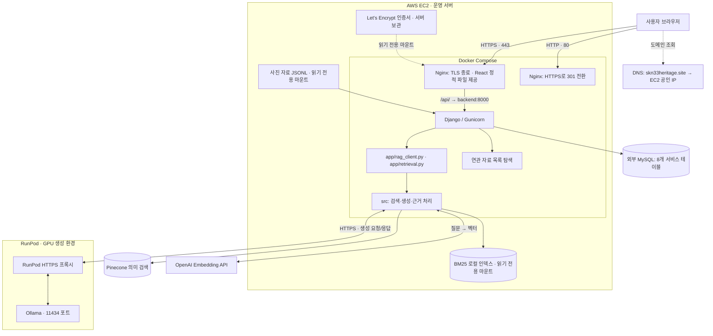
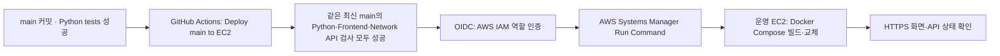
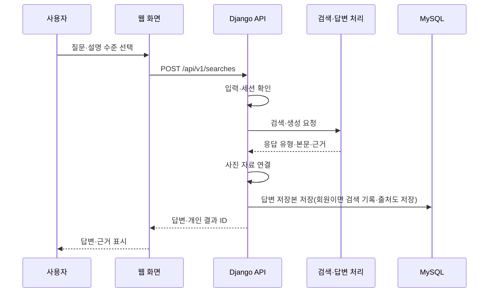
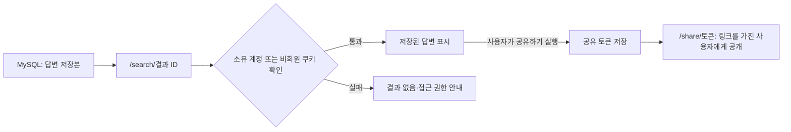
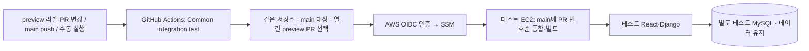
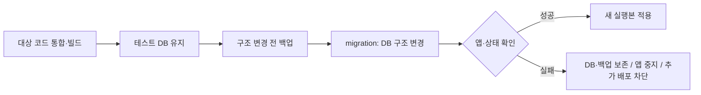

# 시스템 구성도

접속·배포·테스트 환경을 중심으로 정리한 제출용 구성도입니다. 데이터 준비와 검색·근거·생성 내부 구조는 [상세 아키텍처](../03_system_architecture.md)를 참고합니다.

## 1. 전체 구성

아래 도식은 운영 서버와 외부 서비스를 구분한다. 발표자료에는 같은 구성을 정리한 [PNG 구성도](assets/system-architecture.png)를 사용할 수 있다.

### 검색·생성과 응답 반환 흐름

- **검색:** EC2의 검색 코드가 OpenAI Embedding API에서 질문 벡터를 받아 Pinecone을 조회한다. 로컬 BM25의 단어 검색 결과와 결합한 근거를 생성에 사용한다. OpenAI 임베딩은 답변 생성 모델과 별도 역할이다.
- **생성:** EC2에서 `OLLAMA_BASE_URL`의 RunPod HTTPS 프록시로 요청하면 GPU Pod의 Ollama(11434)가 답변을 반환한다. 브라우저는 Django API를 통해 결과를 받는다.
- **반환:** 생성 응답의 형식·근거를 처리한 뒤 Django가 사진 자료를 연결하고 MySQL에 답변 저장본을 저장한다. 결과는 `Django → Nginx → 브라우저` 순서로 돌아간다.

RunPod를 새로 만들 때는 운영 백엔드의 `OLLAMA_BASE_URL`을 새 Pod 주소에 맞추고 백엔드를 재시작한다. 모델은 `OLLAMA_MODEL`로 선택한다. 2026-09-23 팀원이 전달한 모델 태그는 `qwen3.8:27b`이며, 이 문서 작업에서는 운영 서버의 실제 로드 모델을 별도로 조회하지 않았다.

### 도메인·HTTPS 적용과 접속 흐름

1. `skn33heritage.site`의 DNS가 운영 EC2 공인 IP를 가리키도록 연결한다. DNS는 주소 조회에 사용되며 실제 웹 요청은 브라우저에서 EC2로 전달된다.
2. EC2에 80·443 포트로 접근할 수 있도록 보안 그룹을 설정하고, 운영용 `docker-compose.aws.yml`로 Nginx의 80·443 포트를 노출한다.
3. 서버에서 도메인용 Let's Encrypt 인증서를 발급하고 `/etc/letsencrypt`에 보관한다. Nginx는 인증서를 읽기 전용으로 마운트하며, ACME 검증 요청은 `/.well-known/acme-challenge/` 경로로 처리한다.
4. 일반 HTTP 요청은 HTTPS로 전환하고, HTTPS 요청은 Nginx에서 TLS를 종료한다. 화면은 React 정적 파일로 제공하며 `/api/` 요청은 Docker 내부의 `backend:8000`으로 전달한다.
5. Django는 허용 도메인, 보안 쿠키, 신뢰 프록시 설정을 적용한다. 인증서 갱신은 서버의 예약 작업과 갱신 스크립트로 관리한다.

설정 근거: [운영 Compose](../../docker-compose.aws.yml), [Nginx HTTPS 설정](../../deploy/nginx-https.conf), [HTTPS 유지·갱신 절차](../MAIN_HTTPS.md). DNS 제공 업체는 구성도에서 특정하지 않는다.

### AWS 운영 자동 배포 흐름

운영 배포와 공용 테스트 환경은 EC2와 데이터베이스를 공유하지 않는다. [변경 전 PNG 배포도](../archive/assets/deployment-flow-before-ci-gate.png)는 Python 성공만 직접 조건으로 삼던 과거 구성이다. 현재 배포 조건은 아래 흐름을 따른다.

배포 워크플로는 최신 `main`과 해당 커밋의 세 검사 성공을 확인한다. 진행 중이거나 아직 생성되지 않은 검사는 최대 15분 기다리고, 실패·취소·시간 초과 시 배포하지 않는다. 수동 재실행에도 같은 확인을 적용하며, EC2의 기존 `.env`·데이터·인증서를 사용한다. 상세 절차는 [운영 자동 배포](../MAIN_AUTO_DEPLOY.md)를 따른다.

## 2. 구성요소의 역할

| 요소 | 쉬운 설명 | 주요 위치 |
|---|---|---|
| React | 사용자가 보는 질문·답변·계정 화면 | frontend/ |
| Nginx | 웹 파일 제공 및 API 요청 전달 | frontend/, deploy/ |
| Django·Gunicorn | 요청 처리, 권한 확인, DB·AI 연결 | backend/ |
| 기존 RAG 연결 계층 | 웹 요청을 기존 검색·답변 코드로 전달 | app/, backend/api/rag_runtime.py |
| 검색·생성 핵심 코드 | 관련 자료를 찾고 답변과 근거를 구성 | src/ |
| MySQL | 회원·검색 기록·출처·제보·공유 결과 저장 | 외부 DB 또는 테스트용 별도 DB |
| OpenAI Embedding | 의미 검색에 사용할 질문 벡터 생성 | 외부 API · src/rag_indexing/pinecone_store.py |
| Pinecone·BM25 | 의미가 가까운 자료와 단어가 맞는 자료 검색 | 외부 검색 서비스·로컬 인덱스 |
| RunPod·Ollama | GPU에서 설정한 언어모델로 답변 생성 | RunPod HTTPS 프록시 · 별도 GPU Pod |

`app/`의 `rag_client.py`와 `retrieval.py`는 현재 웹의 검색·답변 흐름에서 사용한다. [ERD](04_erd.md)에 회원·검색·제보를 저장하는 8개 테이블과 실제 연결을 표시했다.

## 3. 질문 처리 순서

검색·생성 서비스에 연결하지 못하면 API는 오류 응답을 돌려준다. 저장 단계에서 실패한 요청은 [통합 시험](06_tests.md)의 실패 사례로 확인한다.

### 저장 결과 다시 보기·공유

개인 결과 저장과 공개 공유는 별도 단계다. 저장본 조회는 모델을 다시 호출하지 않는다. [결과·공유 처리 코드](../../backend/api/search_links.py)에 소유권 확인과 공유 토큰 발급이 구현되어 있다.

## 4. 환경 구분

| 환경 | 구성·목적 | 확인 상태 |
|---|---|---|
| 로컬 | Compose의 웹 8081 포트, 외부 서비스 연결 | 설정 파일 확인 |
| 운영 | [skn33heritage.site](https://skn33heritage.site/) · AWS·HTTPS | 도메인 연결·사용 중; 기능별 시험 결과는 별도 관리 |
| 공용 테스트 | 별도 EC2·MySQL, main과 preview PR 조합 | 운영 환경과 분리하여 기능 조합 확인 |

기본 Compose에는 MySQL 서비스가 포함되지 않는다. 테스트 전용 DB 컨테이너 구성과 운영 DB를 같은 구성으로 그리지 않는다.

## 5. 테스트 배포·데이터 보호

### preview PR을 테스트 환경에 반영

이 워크플로는 `INTEGRATION_TEST_ENABLED=true`일 때 실행한다. 현재 저장소의 서버 제어 코드는 대상 PR이 0개여도 최신 `main`으로 테스트 사이트를 유지한다. 과거의 PR 0개 시 중지 동작과 구분하며, 실제 서버에는 갱신된 제어 스크립트가 설치되어 있어야 한다. 테스트 환경에 반영한 PR이 운영에 반영되려면 별도로 `main`에 병합되어 운영 배포 절차를 거쳐야 한다.

구현 근거: [테스트 워크플로](../../.github/workflows/integration-test.yml), [PR 선택](../../scripts/integration/dispatch.py), [테스트 서버 제어](../../scripts/integration/server.py).

### DB 유지와 구조 변경

마이그레이션은 DB 구조를 순서대로 변경하는 작업이다. 실패 시 DB를 삭제하거나 이전 앱을 무조건 실행하지 않는다. 테스트 복제 데이터는 개인정보를 치환하며 운영 DB로 역복사하지 않는다.

구현 자료: [로컬 Compose](../../docker-compose.yml), [백엔드 이미지](../../backend/Dockerfile), [RAG 연결](../../backend/api/rag_runtime.py), [HTTPS 구성](../MAIN_HTTPS.md), [테스트 DB 절차](../TEST_DATABASE_CLONE.md).

## 6. 구성 관리

실행 경로, 생성 모델, DB 구조 변경 이력, 배포 설정을 함께 관리한다. 구성 변경 시 실행 안내와 테스트 결과도 같은 내용으로 갱신한다.

서버 인증 정보는 구성도에 포함하지 않는다.
