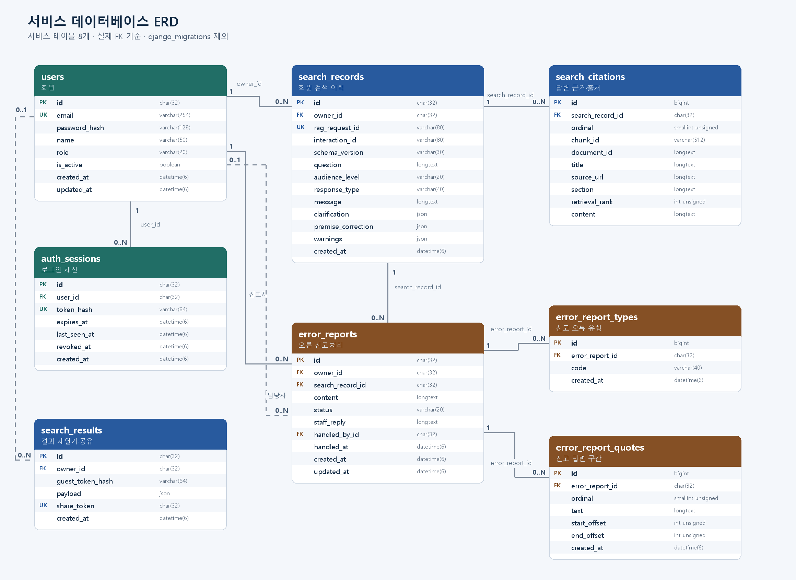
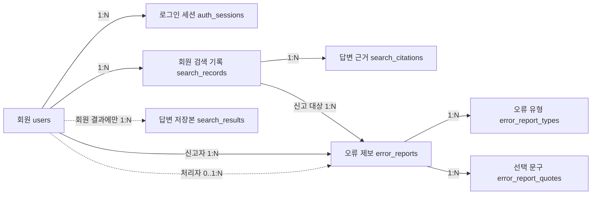

# 서비스 데이터베이스 관계도(ERD)

서비스 데이터베이스는 회원, 질문·답변, 오류 제보 정보를 **8개 업무 테이블**에 저장한다. Django가 적용한 데이터베이스 변경 이력은 별도 `django_migrations` 테이블에 기록된다.

그림의 **1 → 0..N**은 왼쪽의 기록 하나에 오른쪽 기록이 여러 개 연결될 수 있다는 뜻이다. 점선은 연결 대상이 없을 수도 있음을 나타낸다. 예를 들어 비회원의 검색 결과에는 회원 번호가 없다.

## 테이블별 역할

| 테이블 | 저장 내용 | 다른 테이블과의 연결 |
|---|---|---|
| `users` | 회원 이름, 이메일, 비밀번호 해시, 이용 상태 | 검색 기록·로그인 세션·오류 제보·회원 검색 결과의 기준 |
| `auth_sessions` | 로그인 세션의 토큰 해시와 유효기간 | `user_id`로 회원에 연결 |
| `search_records` | 회원 질문, 설명 수준, 답변 유형, 답변 본문 | `owner_id`로 회원에 연결 |
| `search_citations` | 답변에 사용한 문서 제목·원문 주소·근거 문장 | `search_record_id`로 검색 기록에 연결 |
| `search_results` | 답변 화면을 다시 보여 줄 저장본과 공유 토큰 | 회원이면 `owner_id`로 연결; 비회원이면 회원 연결 없음 |
| `error_reports` | 회원이 접수한 답변 오류와 처리 상태·담당자 답변 | 신고자 `owner_id`, 신고 대상 `search_record_id`, 선택적인 처리자 `handled_by_id` |
| `error_report_types` | 제보 한 건에 선택한 오류 유형들 | `error_report_id`로 오류 제보에 연결 |
| `error_report_quotes` | 제보자가 답변에서 선택한 문구와 해당 위치 | `error_report_id`로 오류 제보에 연결 |

**해시**는 원래 값을 그대로 저장하지 않기 위해 계산한 값이다. 로그인 쿠키의 실제 토큰 대신 `token_hash`를 저장한다. **답변 저장본**(`payload`)은 당시의 답변·요약·근거·사진 정보를 담는다. 결과를 다시 열 때 언어모델에 같은 질문을 다시 보내지 않는다.

## 핵심 관계

`search_records`와 `search_results`는 회원의 새 검색에서 같은 ID를 사용할 수 있으나 **서로를 가리키는 외래키(FK)는 없다**. 두 테이블을 DB가 직접 연결한다고 표현하지 않는다. 비회원 검색은 `search_results`에만 저장되고, 검색했던 브라우저의 쿠키로 개인 결과를 연다.

## 제약과 데이터 보존

| 규칙 | 구체적인 동작 |
|---|---|
| 회원 이메일 | 같은 이메일을 두 계정에 사용할 수 없다 |
| 답변 근거 | 한 검색 기록에서 같은 순번이나 같은 `chunk_id`를 중복 저장할 수 없다 |
| 제보 유형 | 한 제보에서 같은 유형 코드를 중복 저장할 수 없다. 여러 **서로 다른** 유형은 선택할 수 있다 |
| 선택 문구 | 한 제보에서 같은 순번을 중복 저장할 수 없다. 선택 위치는 이전 제보와의 호환을 위해 비어 있을 수 있다 |
| 공유 토큰 | 사용자가 공유하기 전에는 값이 없고, 발급된 값은 다른 결과와 중복될 수 없다 |
| 검색 결과 삭제 | 회원 탈퇴 시 회원 소유 결과가 함께 삭제된다. 비회원 결과는 회원 탈퇴 대상에 포함되지 않는다 |
| 제보·근거 삭제 | 제보 삭제 시 유형·선택 문구가, 검색 기록 삭제 시 답변 근거가 함께 삭제된다 |

`error_reports`에는 더 이상 단일 오류 유형을 저장하는 `category` 열이 없다. 여러 오류 유형은 `error_report_types`의 개별 행으로 저장한다. API 응답의 `category`는 이전 화면과의 호환을 위한 값으로, 저장 열을 뜻하지 않는다.

관리자 화면은 별도 관리자 비밀번호와 서명된 쿠키로 접근을 확인한다. `users.role` 값만으로 현재 관리자 API 접근을 허용하지 않는다.

자료: [업무 모델](../../backend/api/models.py), [DB 정리 및 검증](../DB_CLEANING_TEST_ROLLOUT.md), [API 명세](../api/API_SPEC.md).
