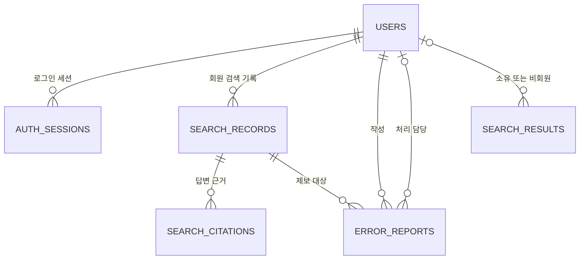

# 데이터 관계도(ERD)

아래 관계도는 Django의 업무 모델 6개를 대상으로 한다. 프레임워크 내부 테이블 등 실제 DB의 전체 테이블 목록과는 구분한다.

DB 구조 정리가 진행 중이므로, 최종 ERD와 마이그레이션 적용 결과의 대조가 필요하다.

## 1. 데이터 관계

ERD는 “어떤 정보를 저장하고, 서로 어떻게 연결하는지”를 보여주는 그림이다.

## 2. 모델별 저장 목적

| 테이블 | 주요 필드 | 목적 |
|---|---|---|
| users | id, email, password_hash, name, role, is_active | 회원 정보 |
| auth_sessions | user_id, token_hash, expires_at, revoked_at | 로그인 상태와 유효기간 |
| search_records | owner_id, question, audience_level, response_type, message | 회원 질문·답변 기록 |
| search_citations | search_record_id, chunk_id, title, source_url, content | 기록에 연결된 근거 |
| error_reports | owner_id, search_record_id, category, status, staff_reply, handled_by_id | 제보와 처리 내용 |
| search_results | owner_id(선택), guest_token_hash, payload, share_token | 재열기·공유용 답변 스냅샷 |

스냅샷은 **답변을 다시 생성하지 않고 당시 화면 내용을 보여주기 위한 저장본**이다. `payload`에는 질문·답변·요약·출처·사진 등 화면 데이터가 들어간다.

## 3. 중요한 연결·제약

| 규칙 | 코드상 의미 |
|---|---|
| 이메일·세션 토큰 해시 중복 금지 | 동일 식별 정보 중복 저장 방지 |
| 검색 기록의 rag_request_id 고유 | 생성 요청 식별자 중복 제한 |
| 기록별 출처 순번·chunk_id 중복 제한 | 같은 기록에서 출처 중복 방지 |
| search_results의 share_token 고유·빈 값 허용 | 공유를 선택하기 전에는 공개 토큰 없음 |
| search_records와 search_results | 회원 신규 검색에서 같은 ID 사용; **직접 FK는 없음** |
| search_results.owner_id 선택값 | 비회원 결과는 소유 회원 없이 쿠키 해시로 접근 |

FK(외래키)는 다른 테이블의 행을 가리키는 연결이다. ID가 같다는 것과 DB가 관계를 강제한다는 것은 다르므로 존재하지 않는 FK를 도식에 추가하지 않았다.

## 4. 삭제 동작 확인 지점

- 회원 검색 기록·제보의 일부 연결은 참조가 남으면 삭제를 제한하는 `RESTRICT` 방식이다.
- 출처는 해당 검색 기록 삭제 시 함께 삭제하는 `CASCADE` 방식이다.
- 제보 처리 담당 회원이 삭제되면 해당 담당 값은 `NULL`로 변경된다.
- 회원 탈퇴 API는 관련 제보·검색 기록·세션을 명시적으로 정리한 후 회원을 삭제한다.
- 관리자 화면 인증은 별도 서명 쿠키 방식이므로 `users.role`이 현재 관리자 API 권한을 결정한다고 표기하지 않는다.

실제 삭제·권한·개인정보 보존 정책은 최종 DB 정리와 함께 재검증한다.

## 5. 데이터 구조 검증 항목

- [ ] 테이블·컬럼 이름과 자료형·NULL 허용·기본값 대조
- [ ] PK·FK·고유 제약·인덱스 대조
- [ ] search_results와 검색 기록의 연결 방식 확정
- [ ] migration 0006_search_result_links 이후 변경의 의존성 확인
- [ ] 기존 데이터를 보존한 테스트 DB에서 migration 검증
- [ ] 탈퇴·공유·제보 데이터 삭제 규칙 확인
- [ ] 실제 DB의 프레임워크·과거 테이블을 업무 모델과 구분

근거: [업무 모델](https://github.com/SpicyAutumn/SKN33-4th-1Team/blob/7811a717e39a853a01c2bb860b6296b38ba48ea0/backend/api/models.py), [마이그레이션](https://github.com/SpicyAutumn/SKN33-4th-1Team/blob/7811a717e39a853a01c2bb860b6296b38ba48ea0/backend/api/migrations), [공유 저장](https://github.com/SpicyAutumn/SKN33-4th-1Team/blob/7811a717e39a853a01c2bb860b6296b38ba48ea0/backend/api/search_links.py), [탈퇴 처리](https://github.com/SpicyAutumn/SKN33-4th-1Team/blob/7811a717e39a853a01c2bb860b6296b38ba48ea0/backend/api/views.py).
