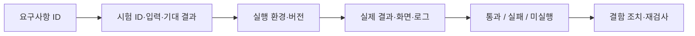

# 테스트 계획 및 통합 결과 보고서

## 1. 시험 목적과 증거 구분

기능이 동작하는지뿐 아니라, 다른 사람의 기록에 접근하지 못하는지, 근거가 적절한지, 실패가 사용자에게 올바르게 안내되는지 확인한다.

| 검사 종류 | 확인하는 것 | 이 결과만으로 확인할 수 없는 것 |
|---|---|---|
| 코드 확인 | 구현·조건·연결의 존재 | 실제 실행 성공 |
| 단위 테스트 | 작은 함수·규칙의 결과 | 전체 서비스 정상 |
| 모의 응답 화면 검사 | 화면 배치·버튼·이동 | 실제 모델·DB 연결 |
| 실제 통합 시험 | 웹·DB·검색·생성의 연결 | 모든 질문의 정확도 |
| 답변 품질 평가 | 정해진 표본의 응답 품질 | 모든 사용자에 대한 성능 |

## 2. 통합 시험 계획

아래는 사용자 관점에서 웹·DB·검색·생성을 함께 확인할 시험이다. 이 문서에 각 시나리오의 실제 입력·화면·판정 결과는 아직 기록되지 않았다. 자동 검사의 실행 결과는 다음 절에 별도로 적었다.

| ID | 요구 | 시험 절차·합격 기준 |
|---|---|---|
| IT-01 | FR-01 | 같은 질문 세 수준 처리; 빈 질문·1,001자·잘못된 수준 거절 |
| IT-02 | FR-02 | 정상·근거 부족·범위 밖·정정·되묻기 사례의 유형과 내용 확인 |
| IT-03 | FR-03 | 인용 ID·원문 대조, 사진 없음 시 본문 정상 |
| IT-04 | FR-04 | 가입·인증·이메일/비밀번호 변경·탈퇴, 잘못된 비밀번호 거절 |
| IT-05 | FR-05 | 회원·비회원 재열기; 다른 계정·쿠키 없는 브라우저 차단; 모델 재호출 없음 |
| IT-06 | FR-06 | 공유 전 접근 차단, 공유 후 비로그인 열람, 반복 발급 동일 링크 |
| IT-07 | FR-07 | 기본 화면에서 유형 한 가지·설명 제보, 타인 기록 차단; 서버의 복수 유형·선택 문구 요청도 별도 확인 |
| IT-08 | FR-08 | 일반 회원 로그인만으로 관리자 접근 불가; 별도 인증 후 처리·회원 화면 반영 |
| IT-09 | FR-09 | 동명 후보·추천 이유·없음·선택 후 질문 전달 확인 |
| IT-10 | FR-10 | 정정·요약·본문 중복, 수준 변경 문맥, 과거 요약 없는 기록 확인 |
| IT-11 | NFR-03·05 | 좁은 화면·긴 답변·RAG 장애·재시도 상태 확인 |
| IT-12 | NFR-04 | 테스트 재배포 전후 DB 보존·백업·실패 후 추가 배포 차단 |
| IT-13 | NFR-01 | 공유 응답에 내부 ID·계정 정보 제외, 탈퇴 후 개인·공유 결과 접근 확인 |

탈퇴·장애·DB 구조 변경 시험은 테스트 계정과 복제 데이터로 수행한다.

## 3. 저장소에서 확인한 자동 검사·배포 결과

2026-09-23에 `main`의 `b660bf7`에서 아래 GitHub Actions 실행이 완료됐다. 각 링크는 실행 기록으로 연결된다.

| 확인 항목 | 실행 결과 | 확인 범위 |
|---|---|---|
| [Python tests](https://github.com/SpicyAutumn/SKN33-4th-1Team/actions/runs/35812207330) | 성공 | Python 단위 검사, 백엔드 API 검사, 검색 링크 검사, DB 구조 검사, 오프라인 실험 검사 |
| [Frontend checks](https://github.com/SpicyAutumn/SKN33-4th-1Team/actions/runs/35812207342) | 성공 | 프런트엔드 자동 검사와 제품 빌드 |
| [Common integration test](https://github.com/SpicyAutumn/SKN33-4th-1Team/actions/runs/35812207315) | 성공 | 공용 테스트 사이트 구성·배포 절차 |
| [Deploy main to EC2](https://github.com/SpicyAutumn/SKN33-4th-1Team/actions/runs/35812285463) | 성공 | 운영 배포 작업 |

작업 성공은 해당 워크플로의 검사를 통과했다는 뜻이다. 위 IT-01~IT-13의 사용자 시나리오 전체를 사람이 실행·판정했다는 기록으로 해석하지 않는다.

## 4. 결과 기록 형식

| 기록 항목 | 필요한 내용 |
|---|---|
| 버전 | 코드 커밋, DB migration, 데이터·모델·Prompt 설정 |
| 환경 | 로컬·테스트·운영, 실행일, 검사자 |
| 조건 | 실제 AI 응답인지 모의 응답인지, 질문·계정 조건 |
| 판정 | 기대 결과, 실제 결과, 통과/실패/미실행 |
| 근거 | 비밀·개인정보를 제거한 화면·로그·결과 파일 |
| 후속 | 결함, 영향, 수정 커밋, 재검사 결과 |

## 5. 기존 모델 비교 결과

출처: [모델 비교 보고서](../experiments/FOURTH_QWEN_BASELINE_RECOMMENDATION.md). 아래 수치는 기존 실험 기록이며 운영 웹의 응답을 다시 평가한 값이 아니다.

| 비교 | EXAONE 기준선 | Qwen 교체 | 의미 |
|---|---:|---:|---|
| Dev 응답 유형 일치 | 55/120 | 104/120 | 개발용 문항의 기대 처리 유형과 일치 |
| Holdout 응답 유형 일치 | 46/120 | 98/120 | 별도 검증 문항의 유형 일치 |
| Dev 정정·되묻기 내용 | 11/40 | 32/40 | 검색 근거와 대조한 잠정 내용 판정 |
| Holdout 정정·되묻기 내용 | 12/40 | 23/40 | 독립 사람 블라인드 평가 아님 |

기준선(Baseline)은 개선 효과를 비교하는 출발 구성이다. Dev는 개발 중 비교한 문항, Holdout은 별도로 비교한 검증 문항이다. 유형 일치는 답변 본문의 사실 정확도와 다르다.

RAGAS 선정 40문항의 제목+본문 근거 충실도는 Dev 0.8198→0.9203, Holdout 0.8769→0.9160이었다. 한국어 역질문 조건의 답변 관련성은 Dev 0.6815→0.5909, Holdout 0.5887→0.6170으로 **일관된 개선이 아니었다**. 120문항 전체 점수로 표현하지 않는다. 고정 검색 문맥, 모델·양자화·실행 환경 차이도 해석에 포함한다.

## 6. 평가 방법을 선택한 이유

| 방법 | 쉬운 설명·산정 방식 | 선택 이유 | 한계 |
|---|---|---|---|
| 응답 유형 일치율 | 기대 유형과 같은 응답 수 / 전체 문항 수 | 답변·보류·정정 선택 확인 | 본문이 틀려도 유형은 맞을 수 있음 |
| 내용 대조 | 정정·되묻기를 근거와 판정 기준에 따라 검토 | 유형만으로 알 수 없는 내용 평가 | 평가자·기준에 영향받음 |
| 근거 충실도(Faithfulness) | 답변 주장 중 검색 근거로 뒷받침되는 비율을 자동 평가 | 근거 밖 주장 탐지 보조 | 자동 평가자의 오판·원문 오류 가능 |
| 답변 관련성(Answer Relevancy) | 답변에서 역으로 만든 질문과 원질문의 의미 유사도 평가 | 질문에서 벗어난 답변 탐지 보조 | 한국어·정당한 보류에 민감; 사실 검증 아님 |
| Hit@k·MRR | 상위 k개 정답 포함 비율·첫 정답 순위 역수 평균 | 검색 단계 원인 분리 | 정답 문서 라벨 필요; 별도 측정값 미수록 |

수업 밖 평가 방법은 이름만 나열하지 않고 **선택 이유·표본·절차·해석·한계**를 함께 제시한다. 기존 RAGAS 한국어 보완 평가와 기본 평가의 조건도 구분한다.

## 7. 데이터베이스 구조·보존 검증

테스트 DB 보존 작업에는 관련 단위 테스트 19개 통과, 테스트 서버 재배포 전후 SQL 덤프 해시 일치, 컨테이너 상태 및 HTTP 200 확인이 [PR #46](https://github.com/SpicyAutumn/SKN33-4th-1Team/pull/46)에 보고됐다.

DB 정리 작업은 [검증 기록](../DB_CLEANING_TEST_ROLLOUT.md)에 서비스 테이블 8개와 변경 이력 테이블 보존, 이전 오류 유형 데이터 이전, 독립 MySQL 복제본의 15→9개 테이블 전환과 행 수 보존을 기록했다. 이때 검색·답변 생성은 고정 응답으로 검사했으므로 실제 모델 품질 검증 결과로 사용하지 않는다.

## 8. 종합 판정

자동 검사와 배포는 성공했다. 사용자 시나리오 IT-01~IT-13의 입력·실제 결과·증거가 아직 채워지지 않아, 이 보고서의 **사용자 관점 전체 통합 시험 판정은 보류**한다. 실측 결과와 결함·제한사항을 기록한 뒤 종합 판정을 갱신한다.

| 결함 ID | 현상·영향 | 수정·재검사 |
|---|---|---|
| 미등록 | 시험 전이므로 결함 없음이라는 뜻이 아님 | 실행 후 작성 |
