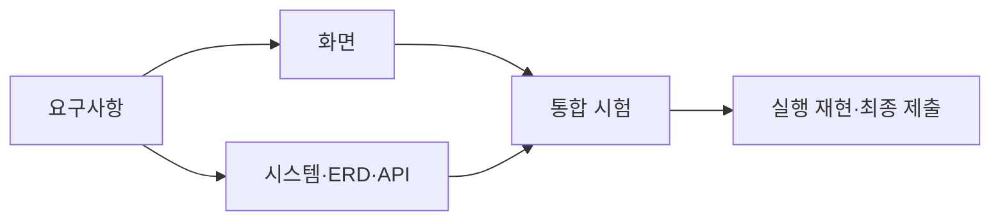

# 4차 프로젝트 산출물

## 개요

개인 맞춤형 AI 문화유산 가이드의 목표, 사용자 요구, 화면, 시스템 구조와 검증 결과를 정리한다.

**운영 서비스: [문화유산 AI 가이드](https://skn33heritage.site/)**

## 산출물 목록

| 산출물 | 문서 | 주요 내용 |
|---|---|---|
| 요구 사항 정의서 | [01 요구사항](01_requirements.md) | 사용자·기능 요구·수용 기준 |
| 화면 설계서 | [02 화면](02_screens.md) | 화면 구성·이동 흐름·상태별 표시 |
| 시스템 아키텍처 | [03 구성도](03_architecture.md) | 구성요소·데이터 흐름·운영 환경 |
| ERD | [04 데이터 관계](04_erd.md) | 업무 데이터·관계·제약 |
| API 명세서 | [05 통신 규칙](05_api.md) | 요청 경로·입력·권한·오류 응답 |
| 테스트 계획 및 통합 결과 | [06 시험·평가](06_tests.md) | 시험 시나리오·평가 방법·결과와 한계 |
| 3차 앱 + 4차 앱 | [07 실행·제출](07_release.md) | 앱 구분·실행 방법·제출 구성 |

## 문서 간 연결

요구사항은 화면과 API의 구현 범위로 연결되며, 테스트에서는 각 요구사항의 충족 여부를 확인한다.

검증 결과는 실제 실행 결과와 기존 보고서 인용을 구분한다. 미실행 시험과 확인이 필요한 데이터 구조는 해당 문서에 명시한다.
