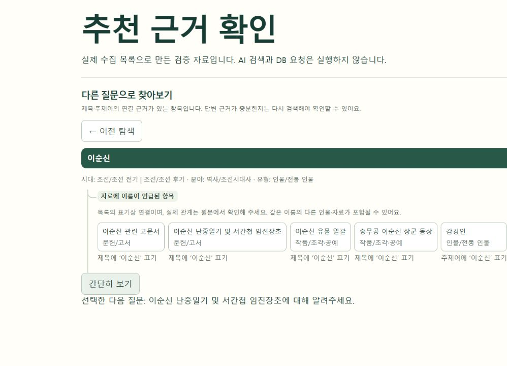
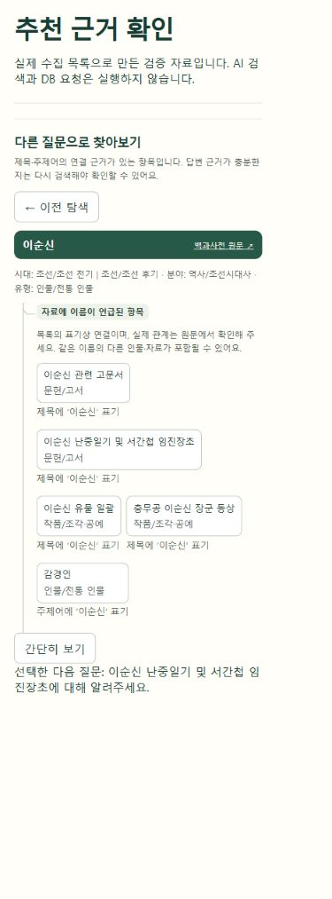

# 함께 알아보기 추천 보완

이전에는 같은 시대·유형·분야의 자료를 제목순으로 나열해, 이순신을 탐색해도 가고·가좌책처럼 직접 연결이 드러나지 않는 항목이 나올 수 있었습니다.

## 변경 내용

| 항목 | 반영 내용 |
| --- | --- |
| 후보 선정 | 제목에 대상 이름이 단어 단위로 있거나, 어느 쪽 주제어에 상대 항목 이름이 있는 자료를 선정 |
| 공통 주제 | 공통 주제어가 2개 이상일 때만 별도 추천. 시대 등 포괄적인 단어와 목록의 1%를 넘는 빈번한 단어는 공통 근거에서 제외(소규모 목록은 3건 기준) |
| 순서 | 제목에 이름이 있는 자료 → 주제어에 이름이 있는 자료. 같은 단계에서는 공통 주제어 수와 희소성을 비교하고, 근거가 같을 때만 제목순 적용 |
| 설명 | 추천 이유·자료 유형을 함께 표시. 근거가 없는 경우 빈 목록 안내 |
| 인물 구분 | 중심 대상의 원래 유형을 유지하고, 동명 후보 선택에 주제어를 표시. 동명 자료가 있으면 실제 관계 확인 안내 |
| 후속 질문 | 인물·사건에도 자연스럽게 사용할 수 있도록 ‘항목명에 대해 알려주세요.’로 전달 |

수집 목록의 제목·주제어를 사용하는 규칙 기반 추천입니다. 본문을 읽어 역사적 관계를 검증하는 기능은 아니며, 동명이인별 정확한 연결은 아직 보장하지 않습니다. 별칭이나 띄어쓰기 없는 복합 제목은 놓칠 수 있습니다. 이 경우 관련 없는 항목으로 수를 채우지 않습니다.

검색·답변 생성 및 선택한 근거 문서 처리 경로는 변경하지 않았습니다. Streamlit의 기존 지도 생성 함수도 유지하고, Django 추천 API에서 새 추천 모듈을 사용합니다. 별도 서비스·키·DB 변경은 없습니다.

## 검증

- Python: 기존 그래프 및 새 추천 정책 14건, Django 추천 API 6건 통과.
- 프런트엔드: 기존 자동 검사 28건 및 제품 빌드 통과.
- 브라우저: 실제 목록으로 생성한 검증 자료에서 이순신 후보 선택, 인물 유형·추천 이유·동명이인 안내, 더보기 및 난중일기 후속 질문 전달을 직접 확인.
- 좁은 화면: 실제 문서 폭 375px에서 가로 넘침 없음 확인.
- 운영 AI 검색·답변 품질은 이번 검증 범위에 포함하지 않음.

재현: `python scripts/build_recommendation_fixture.py` 실행 후 프런트엔드 개발 서버에서 `/recommendation-review.html` 열기. 검증 화면은 목록 기반 모의 응답을 사용하며 AI·DB 호출은 하지 않습니다.

